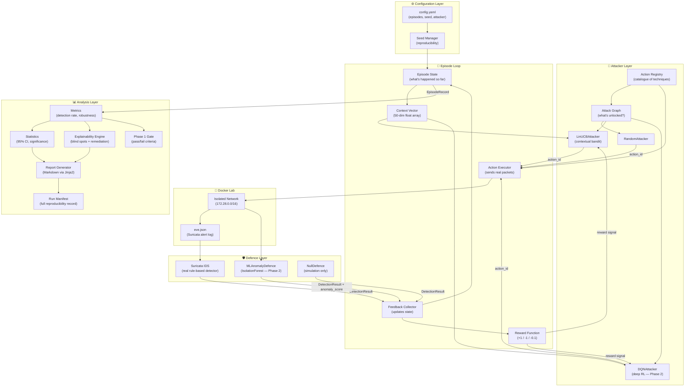
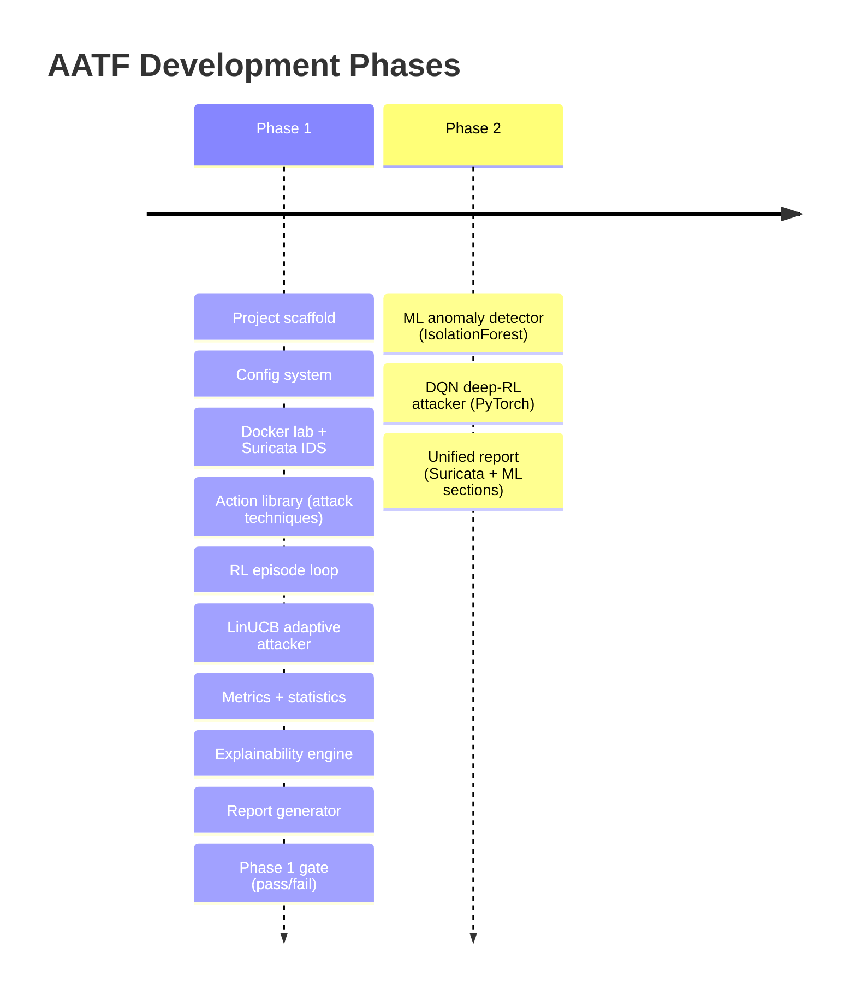
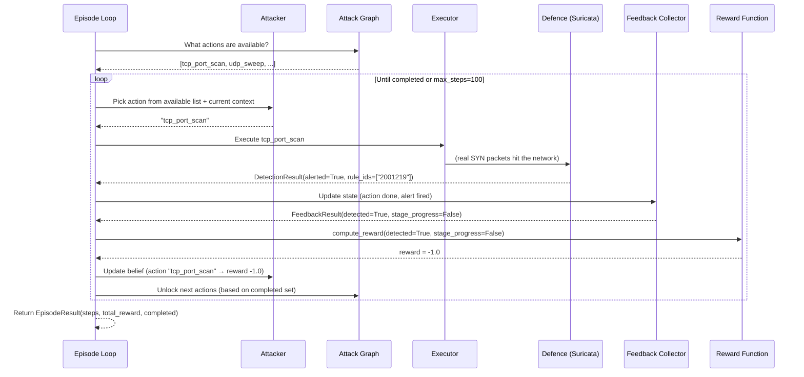

# Section 1 — Overview & Architecture

## What Problem Are We Solving?

Every organisation that runs networked systems — a bank, a hospital, a university — needs to know
**whether its security tools would actually detect an attack**. The traditional way to find out is
called a *penetration test* (pen test): a team of human experts spends weeks probing the system
and writes a report. This is expensive, slow, and not repeatable — run it again next month and
you get slightly different results because different humans made different choices.

**AATF (Adaptive Adversarial Testing Framework)** automates this process using ideas from
machine learning and game theory. At its core, it answers one question:

> *"If a smart attacker kept trying different techniques, which ones would consistently slip
> past your intrusion detection system (IDS) — and how do we fix that?"*

---

## The Core Idea in One Paragraph

We simulate an attacker as a learning agent inside a controlled network environment. The attacker
tries network attack techniques one by one. After each attempt, a defence system (a real
intrusion detection tool called Suricata) either raises an alert or stays silent. The attacker
learns from this feedback — "that technique got me caught, try something else" — and over many
*episodes* (complete attack sequences) it finds the techniques the IDS consistently misses.
We call those **blind spots**. At the end, we generate a report that tells a security engineer
exactly which rules need to be fixed.

---

## Why Is This Research-Worthy?

Most existing adversarial testing tools are either:
- **Static** — they run a fixed script of known attacks (no learning)
- **Black-box scanners** — they find vulnerabilities in software but don't model how a
  persistent, adaptive attacker behaves over time

AATF sits at the intersection of three research areas:

| Research Area | What We Borrow |
|---|---|
| **Reinforcement Learning (RL)** | The attacker learns which actions pay off using reward signals |
| **Network Security** | We use real IDS tools (Suricata) with real rule sets (ET Open) |
| **Explainability / XAI** | We don't just say "this was missed" — we explain *why* and give remediation steps |

The Phase 2 extension (ML defence) adds a fourth dimension: the defender also learns, creating
a true *adversarial co-evolution* loop — something active in current security research.

---

## System Overview (Very High Level)

Think of AATF as a **board game with three players**:

```
┌────────────────────────────────────────────────────────┐
│                    AATF Framework                      │
│                                                        │
│   ┌──────────┐    actions     ┌──────────────┐         │
│   │ ATTACKER │ ────────────► │ ENVIRONMENT  │         │
│   │ (agent)  │               │ (Docker lab) │         │
│   └──────────┘               └──────┬───────┘         │
│        ▲                            │ network traffic  │
│        │ reward                     ▼                  │
│        │                    ┌──────────────┐           │
│        └─────────────────── │   DEFENCE    │           │
│                             │  (Suricata)  │           │
│                             └──────────────┘           │
└────────────────────────────────────────────────────────┘
```

- **Attacker** — a software agent that picks which network attack technique to try next
- **Environment** — a Docker-based isolated network where the attacks run safely
- **Defence** — Suricata IDS watching the network and raising alerts on suspicious traffic

After every attack step, the attacker receives a **reward signal** (+1 if it evaded detection,
-1 if caught) and updates its strategy. After N episodes, we analyse what was evaded and write
a report.

---

## Full System Architecture



---

## The Two Phases

AATF is built in two phases. Phase 1 uses a rule-based IDS. Phase 2 adds a machine-learning
detector. This doc covers **Phase 1** end to end.



---

## The Episode: What Actually Happens Each Run

An *episode* is one complete attack attempt from start to finish. Here is the exact sequence:



---

## Key Definitions (Glossary)

| Term | Plain English Meaning |
|---|---|
| **Episode** | One complete attack run from first probe to exhausted actions or 100 steps |
| **Action** | A single network attack technique (e.g. TCP port scan, SSH brute force) |
| **Attack Graph** | A map of which techniques unlock other techniques (recon unlocks exploitation) |
| **Detection Result** | The IDS's response: did it fire an alert? Which rule? |
| **Reward** | Numerical feedback: +1.0 (evaded), -1.0 (caught), -0.1 (no progress) |
| **Context Vector** | A 50-number summary of "what has happened so far" — the attacker's view of the world |
| **Blind Spot** | An attack technique the IDS consistently misses |
| **LinUCB** | A learning algorithm that balances trying new things vs exploiting what works |
| **Suricata** | Open-source real intrusion detection system (like a security camera for network traffic) |
| **ET Open** | "Emerging Threats Open" — a publicly maintained database of attack signatures for Suricata |
| **eve.json** | Suricata's alert log file, one JSON record per alert |
| **Run Manifest** | A snapshot of every setting used in a run — ensures the result can be reproduced exactly |

---

## What Makes This Different From Just Running Nmap?

A tool like `nmap` scans for open ports. That's a single technique run once. AATF:

1. **Runs hundreds of episodes** — not one scan but a learning process
2. **Adapts** — if a technique keeps getting caught, the attacker shifts to others
3. **Models attack sequences** — a real attacker does recon first, then exploits, then exfiltrates;
   the attack graph enforces this ordering
4. **Measures the defender** — not "is port 22 open?" but "does your IDS catch this?"
5. **Explains** — produces a structured report with remediation steps, not just a list of open ports

---

## Summary

AATF is a **reproducible, adaptive, explainable adversarial testing framework** built on:
- A **reinforcement learning loop** (attacker learns from reward signals)
- A **real detection environment** (Suricata IDS in Docker)
- A **structured analysis pipeline** (metrics → explainability → report → gate)

**Next section:** The technology stack — every library and tool used, and *why* it was chosen
over alternatives.
