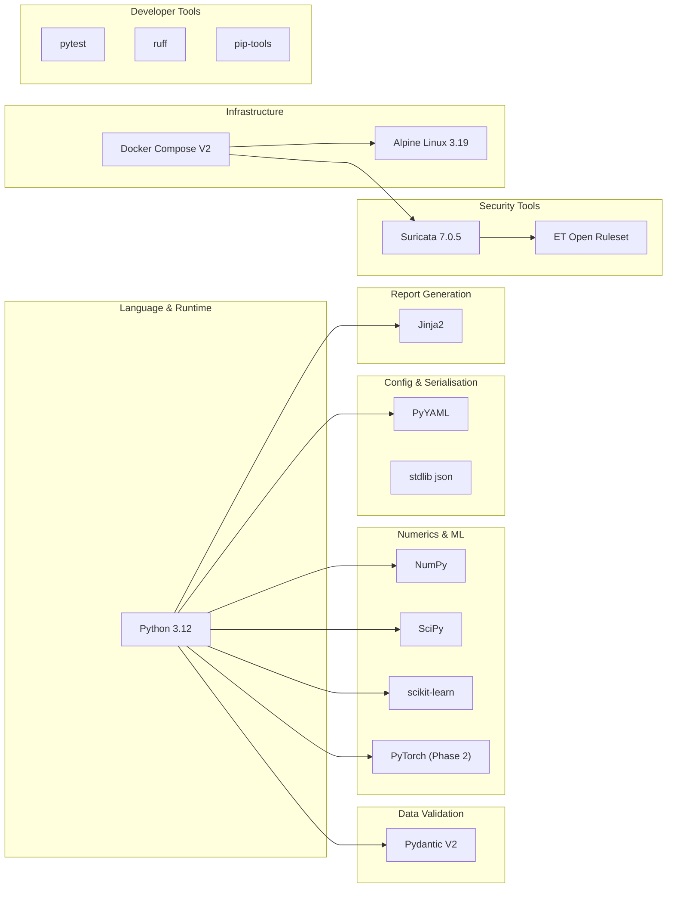
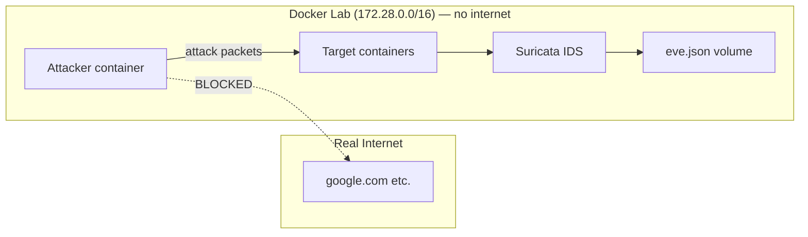

# Section 2 — Technology Stack & Design Rationale

This section explains every tool and library used in AATF, what it does, and — crucially — **why
this one was chosen** over alternatives. For a stakeholder or a reviewer, "why" matters as much
as "what".

---

## The Full Stack at a Glance



---

## Python 3.12

**What it does:** The programming language the entire framework is written in.

**Why Python?**
- The ML/data-science ecosystem (NumPy, scikit-learn, PyTorch) is best supported in Python
- Fast prototyping — academic research cycles are short
- Wide adoption means peers and reviewers can run it easily

**Why 3.12 specifically?**
- 3.12 has significant performance improvements (15–20% faster than 3.11 in benchmarks)
- Type hints are more expressive — critical for `Pydantic V2` integration
- Pinned to an exact version so the experiment is reproducible on any machine

**Alternative considered:** Go or Rust — faster execution but far fewer ML libraries and much
slower to prototype. Not suitable for a research tool.

---

## Pydantic V2

**What it does:** Validates and enforces data types at runtime. Every core data structure
(`Action`, `DetectionResult`, `ExperimentConfig`) is a Pydantic model.

**Why Pydantic?**

In research software, data bugs are silent killers. If your `anomaly_score` accidentally becomes
a string instead of a float, you won't notice until the analysis is wrong. Pydantic catches this
immediately with a clear error message.

```
# Without Pydantic — silent bug
result = {"alerted": True, "anomaly_score": "0.7"}  # string, not float
# With Pydantic — loud, clear error at construction time
result = DetectionResult(alerted=True, anomaly_score="0.7")
# → ValidationError: anomaly_score must be float in [0.0, 1.0]
```

The `frozen=True` setting means a `DetectionResult` cannot be modified after creation —
this enforces **immutability**, preventing state mutation bugs.

**Why V2 specifically?** V2 is 5–50× faster than V1 for validation (Rust-based core), which
matters when validating thousands of records per episode.

**Alternative considered:** Python `dataclasses` (used internally for performance-critical
structures like `StepRecord`). Pydantic is used at system boundaries (config, contracts,
manifest) where external data enters and needs validation.

---

## NumPy

**What it does:** Provides fast numerical arrays used to represent the **context vector**
(the attacker's 50-dimensional view of the world) and the ML feature vectors.

**Why NumPy?**
- The context vector `build_context()` returns a `np.ndarray` of shape `(50,)` — NumPy
  makes this efficient with C-backed memory operations
- scikit-learn and PyTorch both consume NumPy arrays natively
- Vector maths (dot products in LinUCB, feature encoding in ML defence) are 10–100× faster
  than pure Python loops

**Design decision:** The context vector is always `float32`, not `float64`. This halves memory
usage and matches PyTorch's default precision for the DQN attacker.

---

## SciPy ≥ 1.12

**What it does:** Provides statistical functions used in the **statistical rigor module**
(`statistics.py`) — specifically 95% confidence intervals on the mean reward.

**Why SciPy?**
- Research results without confidence intervals are not credible — a single detection rate of
  13.3% is meaningless without knowing the uncertainty range
- SciPy's `scipy.stats.t.interval()` computes exact t-distribution confidence intervals even
  for small sample sizes (20 episodes is small)

**Why not just use `numpy.std()`?** `numpy.std` gives you standard deviation. A confidence
interval requires the t-distribution (for small samples) or normal approximation (for large
samples). SciPy handles this correctly.

---

## scikit-learn ≥ 1.4

**What it does (Phase 2):** Provides `IsolationForest`, the anomaly detection algorithm used
in `MLAnomalyDefence`.

**Why IsolationForest?**
- Detects anomalies without labelled attack data — it only needs examples of "normal" behaviour
- Fast to train (O(n log n)) and predict (O(1) amortised per sample)
- Produces a scalar anomaly score in [−∞, 0] (we map it to [0, 1] via sigmoid)
- Resistant to the curse of dimensionality — works well on 7-dimensional feature vectors

**Why not a neural network detector?** A neural network needs hundreds of labelled
attack examples to train reliably. We want to detect unknown attacks, not just memorise
known signatures. IsolationForest is unsupervised — it only needs normal traffic.

**Alternative considered:** One-Class SVM — similar principle but much slower to train
(O(n²) or O(n³)) and harder to tune.

---

## PyTorch ≥ 2.2 CPU (Phase 2)

**What it does:** Powers the `DQNAttacker` — a deep reinforcement learning agent that uses a
neural network to select attack actions.

**Why PyTorch?**
- Dominant framework for research (most published RL papers use PyTorch)
- Dynamic computation graphs make debugging easier than TensorFlow's static graphs
- `torch.nn` provides the two-layer network used in DQN with minimal boilerplate

**Why CPU-only?** The DQN network is tiny (50 → 64 → 32 → n_actions). Running this on a
GPU would add overhead from data transfer that outweighs the computation savings. CPU-only also
means any machine can run it without a GPU.

---

## PyYAML

**What it does:** Parses `config.yaml` — the human-editable experiment configuration file.

**Why YAML?** Configuration that humans read and edit should be human-friendly. YAML allows
comments (unlike JSON) and is more readable than TOML for nested structures. It is the
standard for Docker Compose, Kubernetes, and CI pipelines — reviewers will recognise it.

**Why not argparse / command-line flags?** A config file is a first-class research artifact —
you can commit it to git, attach it to a paper, and another researcher can reproduce your
exact experiment from it.

---

## Jinja2 ≥ 3.1

**What it does:** Powers the report generator. `report.md.j2` is a template; Jinja2 fills
in the actual values (detection rate, blind spot tables, ML analysis) at runtime.

**Why a template engine?**

The naive approach is string concatenation: `"Detection rate: " + str(rate)`. This becomes
unmaintainable for a multi-section report with conditional blocks. Jinja2 separates *what the
report looks like* (the template) from *how the data is computed* (Python code):

```jinja

## ML Anomaly Defence Analysis
> CAE = {{ "%.4f" | format(ml_summary.cae) }}

```

This block only renders if ML anomaly data is present — zero Python code changes needed to
add this conditional.

**Why Markdown output?** Markdown can be read as plain text, rendered in a browser, converted
to PDF, embedded in a GitHub PR, or pasted into a paper appendix. It is format-agnostic.

---

## Suricata 7.0.5

**What it does:** The real intrusion detection system (IDS) that watches network traffic and
raises alerts when it recognises attack patterns.

**Why Suricata and not Snort?**
- Suricata is multi-threaded — Snort is single-threaded and does not scale
- Suricata outputs `eve.json` (structured JSON events) which is trivial to parse
- Suricata is the industry standard for open-source IDS (used by government agencies, banks)
- Pinned to 7.0.5 so the ruleset behaviour is reproducible

**Why a real IDS and not a simulated one?** Simulated detectors would invalidate the research
claim. If Suricata (the real tool) doesn't catch an attack, that is a *real finding* that a
security team can act on. A simulated detector's misses are meaningless.

---

## ET Open Ruleset (Emerging Threats)

**What it does:** 30,000+ rules that tell Suricata what network patterns to recognise as
attacks. Each rule has a Signature ID (SID) and a category (e.g. `ET SCAN`, `ET EXPLOIT`).

**Why ET Open?**
- Maintained by the Proofpoint threat intelligence team — continuously updated
- Free and open-source (the "Open" edition)
- Industry standard — used in real production deployments
- Rules map cleanly to MITRE ATT&CK framework techniques

**What a rule looks like:**
```
alert tcp any any -> $HOME_NET 22 (msg:"ET SCAN SSH BruteForce Tool"; \
  flow:to_server; threshold:type threshold,track by_src,count 5,seconds 120; \
  classtype:attempted-recon; sid:2001219; rev:7;)
```
This fires if more than 5 SSH connection attempts arrive in 120 seconds from the same source —
a classic brute-force pattern.

---

## Docker Compose V2

**What it does:** Defines and runs the **isolated lab environment** — a private network of
containers where attacks happen safely.

**Why Docker?**
- Complete isolation: the attacker containers cannot reach the real internet
- Reproducible: `docker-compose.yml` is version-controlled and produces the same environment
  on any machine with Docker installed
- Lightweight: the entire lab (Suricata + target containers) uses < 200 MB RAM

**Why isolation matters for research:** Without network isolation, a pen-testing tool could
accidentally attack real systems, causing legal problems and unreproducible results.



---

## pytest

**What it does:** Test framework. 350 tests cover every module.

**Why 350 tests?** Research software without tests is unpublishable. When you report "detection
rate 13.3%", reviewers need confidence that the detection rate calculation is correct. Each test
is a *contract* — a guarantee that a specific behaviour holds.

**Why "contracts" not just "tests"?** Each test file uses `C-001`, `C-002` naming from the
spec-kit methodology. This ties implementation to specification — there is a written spec for
each feature, and the tests prove it is met.

---

## ruff

**What it does:** Linter and formatter for Python code. Enforces code style and catches
common bugs before they run.

**Why ruff?** Written in Rust — checks the entire codebase in under 0.1 seconds. Replaces
`flake8`, `isort`, and `black` with a single tool. CI fails if code does not pass ruff — this
prevents style drift over time.

---

## pip-tools

**What it does:** Compiles `requirements.in` (high-level dependencies) into `requirements.txt`
(fully pinned, hashed dependency list).

**Why pin hashes?** `pip install torch` might install version 2.1.0 today and 2.3.0 in six
months. If the model changes behaviour between versions, your research results change too.
Hash pinning means `pip install --require-hashes -r requirements.txt` installs *exactly* the
version that was used when the paper was written — byte-for-byte identical packages.

---

## Summary Table

| Tool | Category | Why This Over Alternatives |
|---|---|---|
| Python 3.12 | Language | ML ecosystem; pinned for reproducibility |
| Pydantic V2 | Validation | Runtime type safety at system boundaries |
| NumPy | Numerics | C-backed arrays; required by sklearn + PyTorch |
| SciPy | Statistics | Correct confidence intervals for small samples |
| scikit-learn | ML (Phase 2) | IsolationForest: unsupervised, no labelled data needed |
| PyTorch CPU | Deep RL (Phase 2) | Research standard; tiny net fits on CPU |
| PyYAML | Config | Human-readable; version-controllable experiment config |
| Jinja2 | Reporting | Separates template from data; conditional sections |
| Suricata 7.0.5 | IDS | Multi-threaded; JSON output; industry standard |
| ET Open | Rules | Continuously maintained; 30k+ real-world signatures |
| Docker Compose | Lab | Network isolation; fully reproducible environment |
| pytest | Testing | 350 contract-based tests; publishable correctness proof |
| ruff | Linting | Sub-second; replaces 3 tools; CI enforcement |
| pip-tools | Dependency mgmt | Hash-pinned reproducibility; research-grade |

---

**Next section:** Core data contracts — the exact data structures that flow through the system,
why they are immutable, and how they make the pipeline provably correct.
