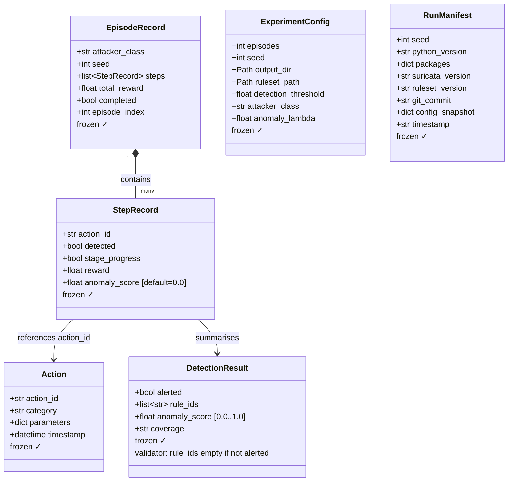
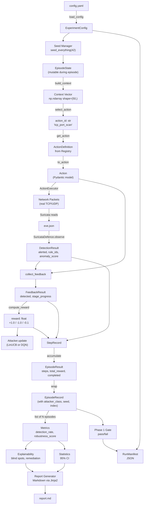

# Section 3 — Data Contracts & Information Flow

This section explains the exact data structures that travel through AATF, how they connect, and
why each field exists. Think of these as the "nouns" of the system — the episode loop, the
attacker, and the defence all speak to each other using these types.

---

## What Is a "Contract"?

In software engineering, a *contract* is a strict agreement about what data looks like. If module
A promises to give module B an `Action` object, that object will always have an `action_id`
string and a `timestamp` datetime — never something else.

In AATF, contracts are enforced by **Pydantic models** (see Section 2). If you try to create a
`DetectionResult` with `anomaly_score = 1.5` (outside the valid range [0.0, 1.0]), Pydantic
immediately raises an error. This means bugs surface at the *moment of creation*, not later when
analysing results.

---

## The Six Core Data Types



---

## Walking Through Each Type

### `Action` — What the attacker did

```python
Action(
    action_id  = "tcp_port_scan",      # unique identifier
    category   = "scan",               # broad technique family
    parameters = {"target_ip": "172.28.0.2", "port_range_end": 1024},
    timestamp  = datetime(2026, 7, 13, 12, 0, 0, tzinfo=UTC),
)
```

- `action_id` is the primary key — the attack graph, action library, and metrics all use it
- `category` maps to Suricata rule categories (`ET SCAN`, `ET EXPLOIT`, etc.)
- `parameters` are the tunable values — target IP, port range, number of attempts
- `timestamp` is when the action happened — used for replay and auditing

**Why frozen?** An `Action` is a historical fact. Once it happened, it cannot change. Immutability
prevents any code from accidentally modifying the record.

---

### `DetectionResult` — What the IDS saw

```python
DetectionResult(
    alerted      = True,
    rule_ids     = ["2001219", "2001220"],   # Suricata SIDs that fired
    anomaly_score = 0.0,                     # ML score (0.0 in Phase 1)
    coverage     = "covered",               # this technique is covered by rules
)
```

- `alerted` — the critical boolean: did the IDS catch this action?
- `rule_ids` — which specific Suricata rules fired (empty list if not alerted)
- `anomaly_score` — always 0.0 in Phase 1; becomes meaningful in Phase 2 with `MLAnomalyDefence`
- `coverage` — `"covered"` (rules exist for this), `"uncovered"` (no rules), `"unknown"`

**Built-in validator:** Pydantic enforces that if `alerted=False` then `rule_ids` must be empty.
You cannot have an alert with no rules, or rules with no alert — this catches logical inconsistencies
before they propagate.

---

### `StepRecord` — One moment captured

`StepRecord` is the compact record written after each attack step. It flattens `Action` and
`DetectionResult` into just the fields needed for analysis:

```python
StepRecord(
    action_id     = "tcp_port_scan",
    detected      = True,           # True if alerted
    stage_progress = False,          # True if this unlocked new actions
    reward        = -1.0,           # what the attacker received
    anomaly_score = 0.0,            # ML score for this step
)
```

**Why not store the full `Action` and `DetectionResult`?** Keeping only what matters for
analysis makes `EpisodeRecord` smaller (cheaper to serialise and analyse) and makes the metrics
module simpler — it just loops over `StepRecord.detected`.

---

### `EpisodeRecord` — One complete attack attempt

```python
EpisodeRecord(
    attacker_class = "DQNAttacker",
    seed           = 42,
    steps          = [StepRecord(...), StepRecord(...), ...],  # all steps
    total_reward   = -3.7,
    completed      = True,   # True = finished all actions; False = hit step limit
    episode_index  = 15,     # which episode number in the run
)
```

An `EpisodeRecord` is the unit of analysis. The metrics module receives a
`list[EpisodeRecord]` and computes detection rate across all steps in all episodes.

**`completed` flag:** If the attacker exhausts all reachable actions, the episode
`completed=True`. If it hits the 100-step limit without finishing, `completed=False`. This
distinction matters — an agent that cannot complete an episode might be stuck in a local
minimum.

---

### `ExperimentConfig` — The experiment settings

Loaded from `config.yaml`. Everything about how the experiment runs:

```python
ExperimentConfig(
    episodes           = 200,
    seed               = 42,
    output_dir         = Path("outputs/dqn_run_001"),
    ruleset_path       = Path("lab/rules"),
    detection_threshold = 0.6,
    attacker_class     = "DQNAttacker",
    anomaly_lambda     = 0.5,   # Phase 2: weight of ML score in reward
)
```

**Why `anomaly_lambda`?** In Phase 2, the reward function can blend Suricata detection with
the ML anomaly score. `anomaly_lambda = 0.0` means Phase 1 only; `0.5` means equal weight.

---

### `RunManifest` — The reproducibility certificate

Written at the end of every run to `output_dir/run_manifest_<ISO>.json`:

```python
RunManifest(
    seed             = 42,
    python_version   = "3.12.13",
    packages         = {"torch": "2.13.0+cpu", "scikit-learn": "1.9.0", ...},
    suricata_version = "7.0.5",
    ruleset_version  = "2026-07-13",
    git_commit       = "dd460bb",
    config_snapshot  = {...},   # full copy of config.yaml at run time
    timestamp        = "2026-07-13T12:27:09Z",
)
```

**Why is this critical for research?** If you publish "detection rate 13.3% with DQN attacker",
a reviewer must be able to reproduce it. The manifest tells them:
- Exact Python version
- Exact package versions (hashed in requirements.txt)
- Exact Suricata version and ruleset date
- Git commit of the framework code
- Full config used

Six months later, with this manifest, anyone can reproduce the exact result.

---

## How Data Flows Through the System

This diagram shows how each data type is produced and consumed:



---

## Immutability: Why Every Record Is Frozen

Every data type that represents a *fact* (something that happened) is marked `frozen=True` in
Pydantic or `@dataclass(frozen=True)`. This means:

```python
step = StepRecord(action_id="tcp_port_scan", detected=True, ...)
step.detected = False  # ← raises FrozenInstanceError immediately
```

**Why does this matter?**
1. **No accidental mutation** — The metrics module receives a list of `EpisodeRecord` objects.
   If it could modify them, a bug could silently corrupt your results.
2. **Thread safety** — Immutable objects can be shared between threads without locks.
3. **Trust** — A `StepRecord` that reaches the report generator is guaranteed to be exactly
   what the episode loop produced.

---

## The State vs Record Distinction

A key design decision is the separation between **mutable state** (during an episode) and
**immutable records** (after an episode).

| | Mutable During Episode | Immutable After Episode |
|---|---|---|
| **Type** | `EpisodeState` | `EpisodeRecord` |
| **Contains** | `set` of completed actions, alert history | `list[StepRecord]`, total_reward |
| **Can change?** | Yes — grows as steps happen | No — frozen forever |
| **Purpose** | Guide the attacker's next decision | Provide data for analysis |

`EpisodeState` is a **Python dataclass** (not Pydantic) because it is modified hundreds of
times per episode and performance matters. `EpisodeRecord` is frozen because it is a historical
fact.

---

## The `coverage` Field Explained

`DetectionResult.coverage` has three possible values:

| Value | Meaning | When |
|---|---|---|
| `"covered"` | Suricata has rules for this technique AND they fired | `alerted=True` |
| `"uncovered"` | Suricata has rules but they didn't fire this time | `alerted=False` from `SuricataDefence` |
| `"unknown"` | We have no IDS watching (simulation mode only) | `NullDefence` |

This distinction is used by the **Explainability Engine** to categorise blind spots: an
`"uncovered"` result means "the IDS has rules but they failed" — perhaps the rule thresholds
need tuning. An `"unknown"` result is from simulation only and excluded from the report.

---

## Summary

| Data Type | Created By | Used By | Frozen? |
|---|---|---|---|
| `Action` | `ActionDefinition.to_action()` | `Defence.observe()`, episode log | ✓ |
| `DetectionResult` | `Defence.observe()` | `collect_feedback()`, `StepRecord` | ✓ |
| `StepRecord` | Episode loop | `EpisodeRecord`, metrics | ✓ |
| `EpisodeRecord` | `run_experiment.py` | Metrics, report, gate | ✓ |
| `ExperimentConfig` | `load_config()` | Everything | ✓ |
| `RunManifest` | `write_manifest()` | Output JSON file | ✓ |
| `EpisodeState` | Episode loop start | Episode loop (mutable) | ✗ |
| `Context Vector` | `build_context()` | Attacker `select_action()` | N/A (numpy array) |

---

**Next section:** The Docker lab and Suricata — how the isolated network is built, how Suricata
is configured, and how `eve.json` bridges the IDS to the Python framework.
