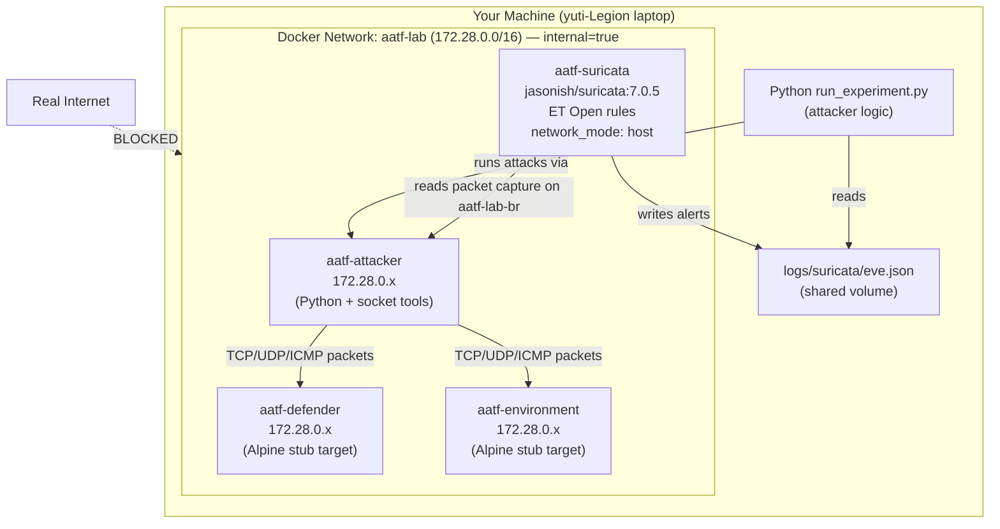
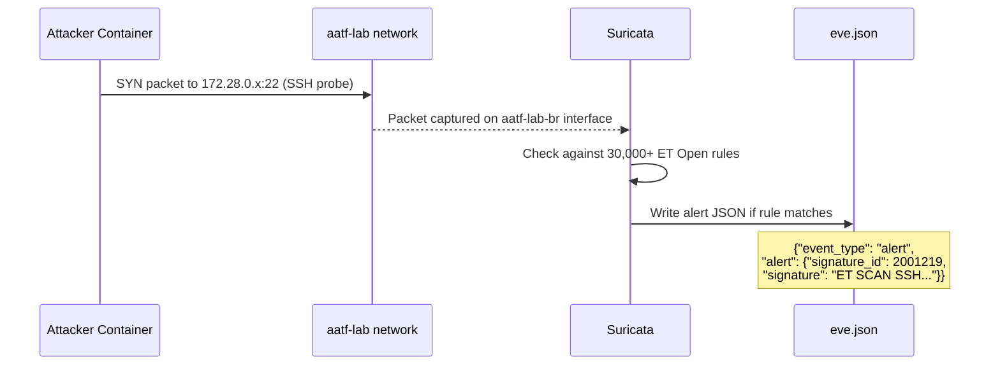
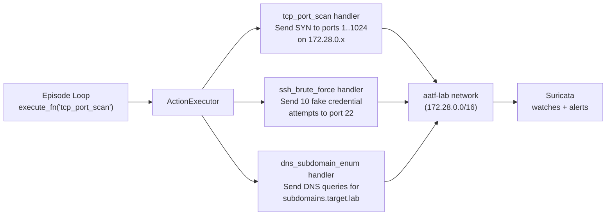
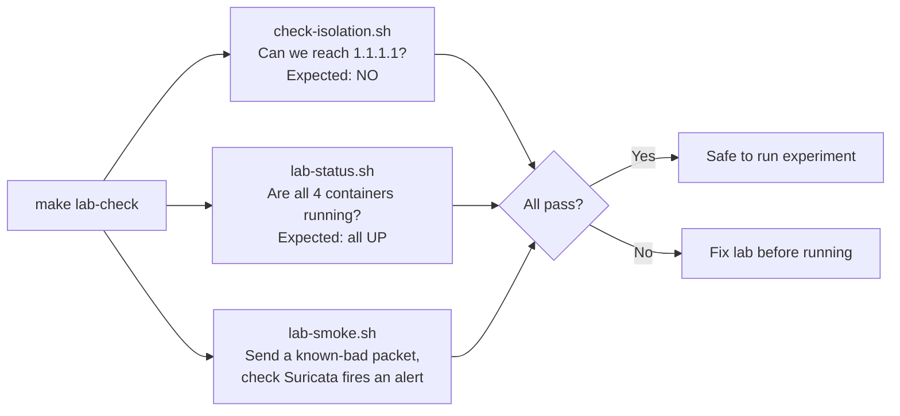

# Section 4 — The Docker Lab & Defence System

This section explains the isolated network environment, why it exists, how Suricata watches
traffic, and how the defence interface connects the security tool to the Python framework.

---

## Why a Lab at All?

When you run a penetration testing tool on a real network, three things can go wrong:
1. You accidentally attack systems you don't own (legal problem)
2. Results depend on which systems happen to be running (not reproducible)
3. Other traffic on the network interferes with your measurement (not clean)

The AATF lab solves all three by creating a **hermetically sealed private network** that only
exists inside Docker on your machine. Attack traffic never leaves. The environment is always the
same. There is no background noise.

---

## Lab Architecture



**Key detail:** Suricata runs in `network_mode: host` — it captures packets directly on the
`aatf-lab-br` bridge interface on the host. This means it sees *all* traffic between the attacker
and target containers in real time, without any special routing.

---

## The Internal Network Flag

```yaml
networks:
  lab:
    name: aatf-lab
    internal: true   # ← THIS is what blocks internet access
```

`internal: true` tells Docker to create a network with **no default gateway**. Containers on
this network can talk to each other but cannot reach the internet. A safety check script
(`lab/scripts/check-isolation.sh`) verifies this before any experiment runs.

---

## The Four Lab Containers

| Container | Image | Role |
|---|---|---|
| `aatf-attacker` | Custom (Python + tools) | Where attack packets originate |
| `aatf-defender` | Alpine 3.19 (stub) | Fake target (SSH, HTTP services) |
| `aatf-environment` | Alpine 3.19 (stub) | Second fake target |
| `aatf-suricata` | jasonish/suricata:7.0.5 | Real IDS watching all traffic |

**Why Alpine for targets?** Alpine Linux is a minimal 5 MB image — it starts in under a second
and uses almost no memory. At this stage of the project, the targets are stubs: they accept
connections but don't run real services. Replacing them with real nginx/SSH containers is a
planned next step.

---

## Suricata: How It Works

Suricata is an **Intrusion Detection System (IDS)** — software that inspects network traffic
and raises alerts when it recognises attack patterns.



Suricata writes one JSON record per alert to `eve.json`. The Python framework reads this file
to know whether an attack was detected.

---

## ET Open Rules

The ET (Emerging Threats) Open ruleset contains over 30,000 rules. Each rule describes a
pattern that indicates malicious traffic.

**Example rule:**
```
alert tcp any any -> $HOME_NET 22 (
    msg:"ET SCAN SSH BruteForce Tool";
    flow:to_server;
    threshold:type threshold, track by_src, count 5, seconds 120;
    classtype:attempted-recon;
    sid:2001219;
    rev:7;
)
```

**Breaking this down:**
- `alert tcp` — match TCP traffic and create an alert
- `any any -> $HOME_NET 22` — from anywhere, to any port 22 (SSH) on our network
- `threshold: count 5, seconds 120` — only fire if 5+ attempts in 120 seconds
- `sid:2001219` — unique signature ID (used in `DetectionResult.rule_ids`)
- `classtype:attempted-recon` — maps to `ET SCAN` category

The threshold is why a **single** SSH probe doesn't trigger this rule — the attacker has to be
aggressive enough to exceed the threshold.

---

## The `disabled.conf` File

```
# lab/rules/disabled.conf
# Rules disabled to avoid false positives in the lab environment
```

Some rules fire on completely normal traffic (e.g., any DNS query might trigger a broad DNS rule).
`disabled.conf` lists SIDs to suppress, keeping the lab signal clean.

---

## The Defence Interface

All defence systems in AATF implement one interface:

```python
class Defence(ABC):
    @abstractmethod
    def observe(self, action: Action) -> DetectionResult: ...
```

Any object with an `observe()` method that takes an `Action` and returns a `DetectionResult`
is a valid defence. This design pattern is called **dependency injection** — the episode loop
doesn't care *which* defence it's talking to, only that it respects this interface.

This is what allows the same episode loop to work with three completely different defenders:

```mermaid
graph LR
    LOOP["Episode Loop"] -->|observe(action)| D{Which Defence?}
    D -->|simulation mode| NULL["NullDefence\nalerted=False always\nfor testing without lab"]
    D -->|lab mode| SUR["SuricataDefence\nreads eve.json\nreal Suricata alerts"]
    D -->|Phase 2| ML["MLAnomalyDefence\nIsolationForest\nanomaly_score > 0"]
```

---

## `SuricataDefence` in Detail

This is the bridge between Suricata (a C binary writing JSON) and Python (reading that JSON).

```python
class SuricataDefence(Defence):
    def __init__(self, eve_path: str | Path) -> None:
        self._eve_path = Path(eve_path)
        self._cursor: int = 0      # file read position

    def observe(self, action: Action) -> DetectionResult:
        # Read only NEW bytes since last call
        with open(self._eve_path, "rb") as fh:
            fh.seek(self._cursor)
            new_bytes = fh.read()
            self._cursor = fh.tell()

        # Parse JSON lines, collect SIDs
        sids = []
        for line in new_bytes.splitlines():
            event = json.loads(line)
            if event.get("event_type") == "alert":
                sids.append(str(event["alert"]["signature_id"]))

        return DetectionResult(
            alerted=bool(sids),
            rule_ids=sids,
            anomaly_score=0.0,
            coverage="covered" if sids else "uncovered",
        )
```

**The cursor trick:** `_cursor` tracks how far into `eve.json` we have already read. Each call
to `observe()` reads only the new bytes written since the last call. This avoids re-reading old
alerts from previous actions in the same episode.

**Why `rb` (binary mode)?** Network events can contain non-UTF-8 bytes (e.g. raw packet
content). Binary mode avoids decoding errors; we decode each line separately with
`errors="replace"`.

---

## `NullDefence` — For Simulation

```python
class NullDefence(Defence):
    def observe(self, action: Action) -> DetectionResult:
        return DetectionResult(
            alerted=False, rule_ids=[], anomaly_score=0.0, coverage="unknown"
        )
```

`NullDefence` always returns "not detected". It is used when:
1. Running tests (no Docker needed)
2. Training the DQN attacker in simulation before deploying to the lab

This is why `anomaly_score=0.0` always in the DQN lab run results we saw — the attacker was
trained against `NullDefence` and then tested against `SuricataDefence`, neither of which
produces ML anomaly scores.

---

## The Action Executor

The action executor translates an `action_id` into real network traffic. When the episode loop
calls `execute_fn("tcp_port_scan")`, the executor sends actual TCP SYN packets to target hosts
in the lab network.



**Safety guard:** The executor checks that every target IP is within `172.28.0.0/16` before
sending any packet. If somehow an action tried to target `8.8.8.8` (Google's DNS), it would
raise `ExternalTargetError` immediately. This is a belt-and-suspenders safety check — the
network isolation already blocks this, but the code-level check makes the intent explicit and
testable.

---

## The `time.sleep(1.5)` in Lab Mode

Every action in lab mode includes a 1.5-second sleep between steps. Why?

1. **Give Suricata time to write alerts** — Suricata processes packets asynchronously. Without
   a delay, `SuricataDefence.observe()` might read `eve.json` before Suricata has written the
   alert for the action that just happened.
2. **Prevent packet flooding** — Rapid-fire packets can overwhelm the lab network's packet
   capture, causing missed detections.
3. **Realistic pacing** — A real attacker doesn't probe at machine speed.

This is why 200 episodes × 100 max steps × 1.5s ≈ 30,000 seconds ≈ 8 hours. In production
use, this would be tuned to the specific lab environment's capabilities.

---

## Lab Verification

Before any experiment, three checks run automatically:



The smoke test is particularly important — it proves that Suricata is actually detecting things
before you run a 200-episode experiment and discover it was silently broken.

---

## Summary

| Component | What it does | Why it matters |
|---|---|---|
| Docker internal network | Blocks internet access | Safety + reproducibility |
| aatf-attacker container | Sends real network packets | Real attack traffic, not simulation |
| aatf-suricata container | Runs real IDS | Real detection, not mocked |
| eve.json | Suricata's JSON alert log | The bridge between C tool and Python |
| SuricataDefence | Python reader of eve.json | Translates raw JSON to `DetectionResult` |
| NullDefence | Returns "not detected" always | Simulation + unit testing |
| ActionExecutor | Sends TCP/UDP/ICMP/DNS packets | Makes attacks real |
| `disabled.conf` | Suppresses noisy rules | Keeps lab signal clean |
| Safety guard (IP check) | Blocks non-lab IPs | Code-level safety net |

---

**Next section:** The attack system — the Action Library, Attack Graph, and how the attacker
learns which techniques to try and in what order.
