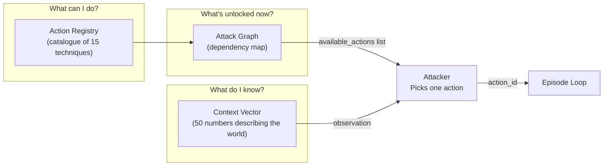
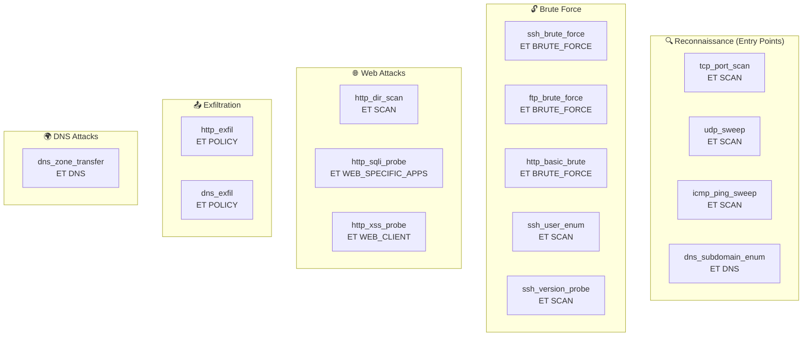
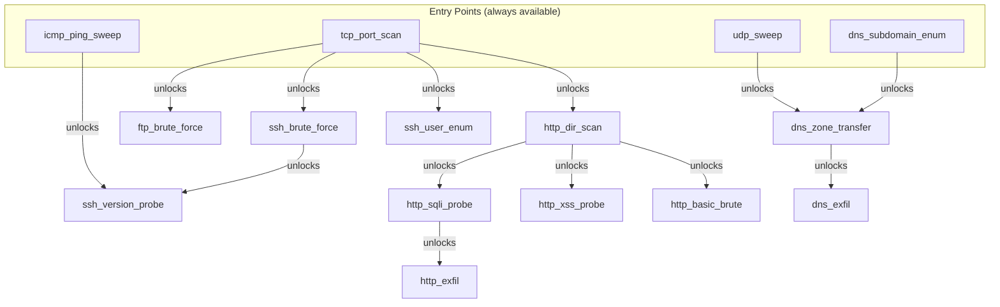
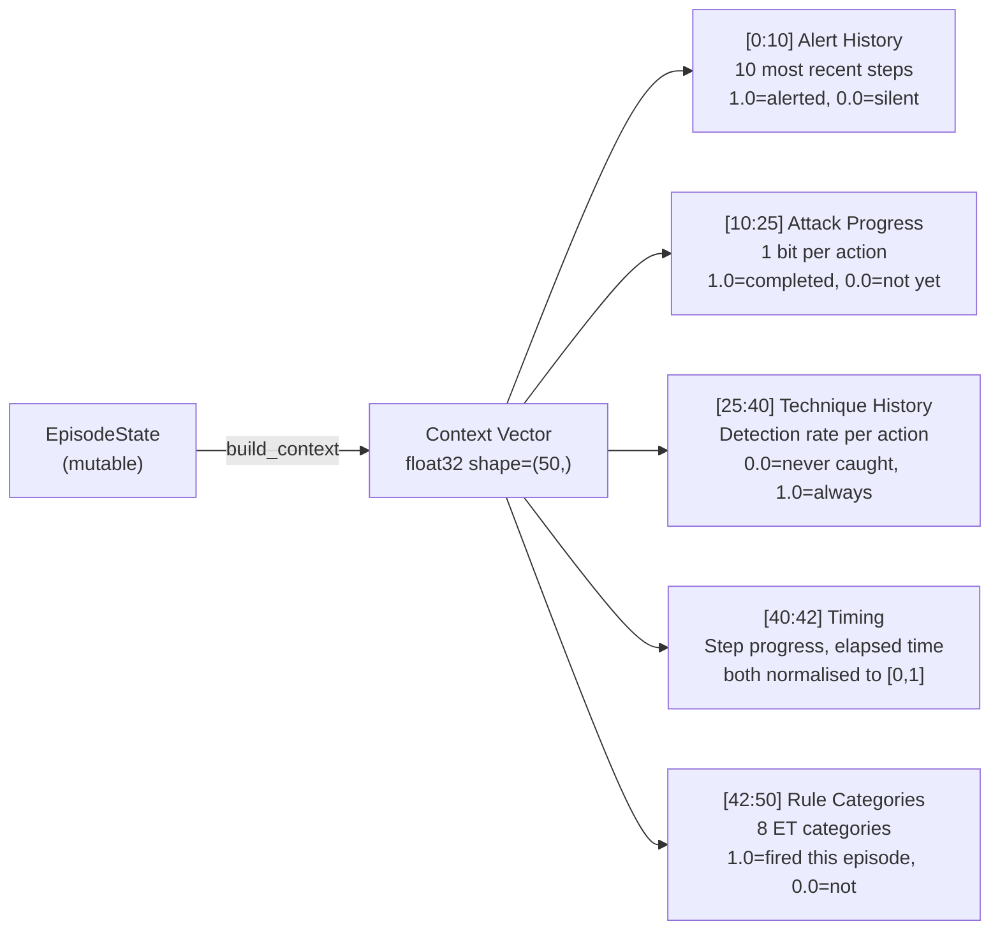
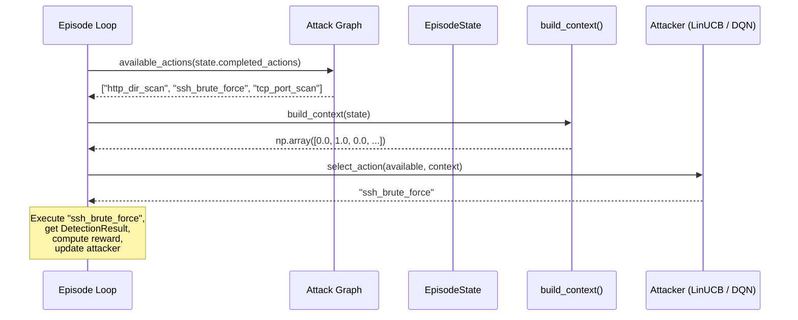

# Section 5 — The Attack System: Actions, Graph & Context

This section covers how the attacker knows *what* techniques exist, *which ones are available
right now*, and *how it perceives the world* before making each decision.

---

## The Three Components of Attack



---

## The Action Library

The **Action Registry** is the catalogue of every network attack technique the attacker can use.
Each entry is an `ActionDefinition`:

```python
@dataclass(frozen=True)
class ActionDefinition:
    action_id: str            # unique key: "tcp_port_scan"
    category: str             # technique family: "scan"
    description: str          # human-readable: "TCP SYN scan of common ports"
    default_parameters: dict  # {"target_ip": "172.28.0.2", "port_range_end": 1024}
    suricata_category: str    # which ET rule category covers this: "ET SCAN"
```

The full registry has **15 actions** across 5 categories:



**Why these 15?** They map to the most common MITRE ATT&CK tactics: Initial Access (recon),
Credential Access (brute force), Discovery (web scanning), and Exfiltration. Together they form
a realistic attack chain.

---

## The Attack Graph

Not all techniques are available from the start. Real attackers follow a **kill chain** — you
need to know a target exists (recon) before you can attack it (exploitation). The **Attack Graph**
models these dependencies.



**How `available_actions()` works:**

```python
def available_actions(self, completed: set[str]) -> list[str]:
    reachable = set(self.entry_points)            # start with entry points
    for action_id in completed:
        reachable |= self.edges.get(action_id, frozenset())  # add unlocked actions
    return sorted(reachable)
```

If the attacker has completed `tcp_port_scan`, the available set becomes:
```
{tcp_port_scan, udp_sweep, icmp_ping_sweep, dns_subdomain_enum}  ← entry points
∪ {ssh_brute_force, ftp_brute_force, http_dir_scan, ssh_user_enum}  ← unlocked by tcp_port_scan
= 8 actions available
```

**Completed actions are excluded** — you don't run the same scan twice.

**Validation at startup:** The `AttackGraph.__post_init__()` checks that:
1. Every action_id in the graph exists in the Registry
2. Every action_id in the Registry is reachable from the graph

If you add a new technique to the Registry but forget to add it to the graph, the system
refuses to start. This prevents silent "unreachable action" bugs.

---

## The Context Vector — The Attacker's Eyes

Before picking the next action, the attacker needs to know: *what has happened so far?* This
is encoded as a **50-dimensional float32 array** called the **context vector**.



**CONTEXT_DIM = 50** — this is chosen to be large enough to capture meaningful history while
small enough for efficient neural network processing.

Let's walk through each segment with an example:

### Segment 1: Alert History `[0:10]`

The last 10 steps, encoded as 1.0 (alerted) or 0.0 (not alerted):

```
Episode step 7, alert history = [False, True, False, False, True, True, False]
Alert window (10 most recent, padded with 0.0 at start):
[0.0, 0.0, 0.0, 0.0, 0.0, 0.0, 1.0, 0.0, 0.0, 1.0, 1.0, 0.0]
→ wait, that's 12. Take last 10:
[0.0, 0.0, 1.0, 0.0, 0.0, 1.0, 1.0, 0.0]
→ padded to 10: [0.0, 0.0, 0.0, 0.0, 1.0, 0.0, 0.0, 1.0, 1.0, 0.0]
```

This tells the attacker: "three of the last ten actions were caught — and the last two in a
row were caught." The attacker should probably try something different.

### Segment 2: Attack Progress `[10:25]`

One entry per action (sorted alphabetically), 1.0 if completed:

```
_SORTED_ACTION_IDS = ["dns_exfil", "dns_subdomain_enum", ..., "udp_sweep"]  # 15 actions
If completed = {"tcp_port_scan", "ssh_brute_force"}:
progress = [0.0, 0.0, 0.0, 0.0, 0.0, 0.0, 0.0, 0.0, 1.0, 1.0, 0.0, 0.0, 0.0, 1.0, 0.0]
           ↑ dns_exfil not done                          ↑ ssh_brute done  ↑ tcp_port_scan done
```

### Segment 3: Technique History `[25:40]`

Per-action detection rate from all past observations in this episode:

```
If tcp_port_scan was tried twice: once detected, once not
→ detection rate = 0.5
```

This lets the attacker remember "every time I try ssh_brute_force, I get caught."

### Segment 4: Timing `[40:42]`

```python
step_norm    = min(step / MAX_STEPS, 1.0)      # 0.0 at start, 1.0 at step 100
elapsed_norm = min(elapsed_seconds / 3600, 1.0) # 0.0 at start, 1.0 at 1 hour
```

Tells the attacker "I'm 60% through my step budget — I should hurry up."

### Segment 5: Rule Categories Fired `[42:50]`

```python
ET_CATEGORIES = ["ET SCAN", "ET EXPLOIT", "ET BRUTE_FORCE", "ET WEB_SPECIFIC_APPS",
                 "ET DNS", "ET POLICY", "ET TROJAN", "ET INFO"]
```

If `ET SCAN` and `ET BRUTE_FORCE` rules fired this episode:
```
[1.0, 0.0, 1.0, 0.0, 0.0, 0.0, 0.0, 0.0]
```

The attacker knows which *categories* of rules have fired, not just whether individual actions
were caught. This helps generalise — if all scan techniques trigger `ET SCAN`, the attacker
might avoid scan-category techniques entirely.

---

## Why 50 Dimensions?

Let's count: 10 (alert history) + 15 (progress) + 15 (technique rates) + 2 (timing) + 8
(categories) = **50**. Every dimension has a specific meaning. There are no "empty" slots.

**Why not more?** The LinUCB algorithm's complexity is O(d²) where d is context dimension.
At d=50, each update is a 50×50 matrix operation — fast. At d=500, it would be 100× slower.

**Why not a raw packet dump?** That would be thousands of dimensions with no structure. The
context vector is a *feature engineering* decision: we hand-select the most decision-relevant
information and represent it compactly.

---

## The `EpisodeState` Object

The context vector is built from `EpisodeState`, which is mutated as the episode progresses:

```python
@dataclass
class EpisodeState:
    completed_actions: set[str]           # which actions have been tried
    detection_history: dict[str, list[bool]]  # per-action alert history
    alert_history: list[bool]             # global alert sequence
    step: int                             # current step number
    start_time: float                     # when episode started (unix timestamp)
    fired_categories: set[str]            # which ET categories have fired
```

`EpisodeState` is a **mutable Python dataclass**, not a Pydantic model. This is a performance
decision — it is updated hundreds of times per episode, and Pydantic's validation overhead
would add up. The immutability guarantee at the episode level comes from `EpisodeRecord`
(which is frozen), not `EpisodeState`.

---

## How the Attacker Selects an Action



**The attacker never picks from the full 15 actions** — only from `available_actions()`,
which respects the attack graph ordering. This enforces the realistic constraint that you
cannot exfiltrate data before you have exploited a vulnerability to reach it.

---

## The Three Attacker Types

### `RandomAttacker`

```python
def select_action(self, available: list[str], _: EpisodeState) -> str:
    return self._rng.choice(available)
```

Picks uniformly at random. Used as a baseline — if your "smart" attacker doesn't do better
than random, there's a problem.

### `LinUCBAttacker` (Phase 1 learning attacker)

Uses the **LinUCB contextual bandit** algorithm. See Section 6 for full detail.

### `DQNAttacker` (Phase 2 deep RL attacker)

Uses a neural network trained with **Deep Q-Networks**. See the Phase 2 section for detail.

---

## Safety: The Safety Guard

```python
def safety_guard(registry: ActionRegistry) -> list[SafetyViolation]:
    for action in registry.list_actions():
        for key, value in action.default_parameters.items():
            if addr.is_global:   # is this a public internet IP?
                violations.append(SafetyViolation(..., reason="publicly routable IP"))
```

At startup, `safety_guard()` scans all default parameters. If any action has a publicly
routable IP address as a target (e.g. `1.2.3.4`), the framework refuses to start. Every
target must be within `172.28.0.0/16` (the lab network).

---

## Summary

| Component | Purpose | Key Design Decision |
|---|---|---|
| Action Registry | Catalogue of 15 attack techniques | Frozen dataclasses; safety guard checks IPs |
| Attack Graph | Unlock order (recon → exploitation) | Validated at startup; reflects real kill chain |
| Context Vector | 50-number world state for the attacker | Fixed-dimension; every slot has a meaning |
| EpisodeState | Mutable state during an episode | Python dataclass (not Pydantic) for speed |
| `available_actions()` | What can be tried right now | Respects graph ordering; excludes completed |
| Safety Guard | Blocks internet-facing actions | Code-level safety net complementing network isolation |

---

**Next section:** The reinforcement learning loop — how LinUCB learns, what reward signals mean,
and how feedback is collected between steps.
