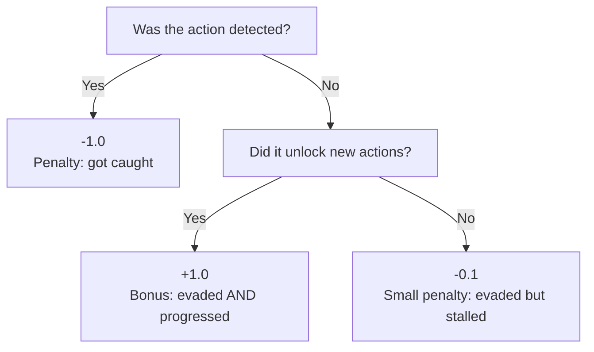
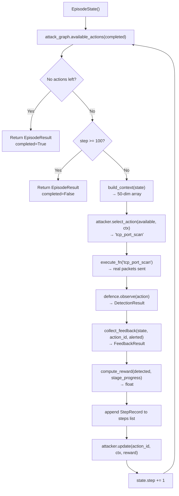
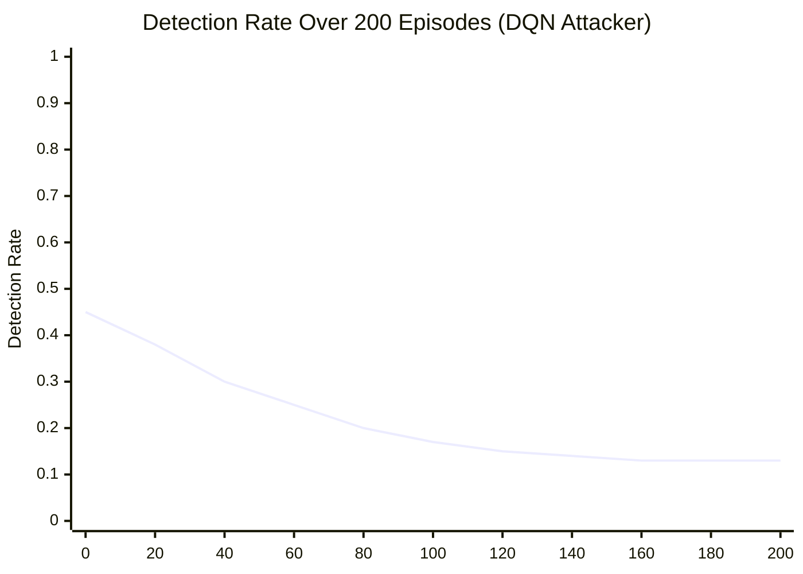

# Section 6 — The Reinforcement Learning Loop

This section explains how the attacker *learns*, what the reward signal means, and the
mathematics behind LinUCB — all in plain language.

---

## What Is Reinforcement Learning?

Imagine training a dog. You don't write rules like "sit when I say sit." Instead, you give
treats (positive reward) when the dog does what you want and ignore or correct it when it
doesn't. Over time, the dog learns which behaviours pay off.

Reinforcement Learning (RL) is the same idea applied to software:
- The **agent** (attacker) takes **actions**
- The **environment** gives back a **reward** (positive = good, negative = bad)
- The agent adjusts its strategy to maximise total reward over time

In AATF:
- Agent = the attacker (LinUCB or DQN)
- Actions = attack techniques (tcp_port_scan, ssh_brute_force, etc.)
- Environment = the network lab + Suricata IDS
- Reward = +1 if evaded, −1 if caught, −0.1 if no progress

```mermaid
graph LR
    A["Agent\n(Attacker)"] -->|action: 'ssh_brute_force'| E["Environment\n(Lab + Suricata)"]
    E -->|reward: -1.0\n(caught)| A
    E -->|next state\n(Context Vector)| A
    A -->|updated strategy| A
```

---

## The Reward Function

The reward function is the **core feedback signal** that teaches the attacker what works.

```python
REWARD_DETECTED   = -1.0   # Got caught → bad
REWARD_PROGRESS   = +1.0   # Evaded AND unlocked new actions → great
REWARD_STALL      = -0.1   # Evaded but no new actions unlocked → okay but stalling

def compute_reward(detected: bool, stage_progress: bool) -> float:
    if detected:
        return REWARD_DETECTED
    if stage_progress:
        return REWARD_PROGRESS
    return REWARD_STALL
```

**Why three values and not just +1/-1?**

The `-0.1` stall penalty is crucial. Without it, an attacker that found one action that
consistently evades detection would just repeat that action forever (infinite reward, no
progress). The `-0.1` nudges it to keep exploring and completing the attack chain.



**Why not a reward based on the actual damage done?** In a real pen test you might reward
"successfully exfiltrated data." In AATF, we're measuring the *defender's* capability, not
maximising actual damage. The reward is designed to drive the attacker to explore all
techniques, not to optimise real-world harm.

---

## The Feedback Collector

After each step, `collect_feedback()` updates `EpisodeState` and determines whether the action
made progress:

```python
def collect_feedback(episode_state, action_id, alert_fired, attack_graph, category):
    # Before: what actions were available?
    before_actions = set(attack_graph.available_actions(episode_state.completed_actions))

    # Update state
    episode_state.alert_history.append(alert_fired)
    episode_state.detection_history.setdefault(action_id, []).append(alert_fired)
    episode_state.completed_actions.add(action_id)
    episode_state.step += 1
    if alert_fired and category is not None:
        episode_state.fired_categories.add(category)

    # After: what actions are now available?
    after_actions = set(attack_graph.available_actions(episode_state.completed_actions))

    # Progress = new actions unlocked
    stage_progress = bool(after_actions - before_actions)
    return FeedbackResult(detected=alert_fired, stage_progress=stage_progress)
```

**`stage_progress`** answers "did completing this action open up new techniques?" If `tcp_port_scan`
was just completed, `after_actions` now includes `ssh_brute_force`, `ftp_brute_force`, etc. —
those are new, so `stage_progress=True`.

---

## What Is a Contextual Bandit?

Before explaining LinUCB, let's understand the problem it solves.

### The Classic Multi-Armed Bandit

Imagine a row of slot machines. Each machine has a different (unknown) payout rate. You want
to maximise your winnings. You can either:
- **Exploit** — keep playing the machine that's paid out most so far
- **Explore** — try other machines in case one is even better

This is the **exploration vs exploitation trade-off** — a core problem in RL.

### The Contextual Bandit

A *contextual bandit* adds one twist: before each pull, you receive **context** — information
about the current state. The payout rate of each machine might depend on this context.

In AATF:
- Each "machine" is an attack technique (action_id)
- The "context" is the 50-dimensional context vector (alert history, progress, etc.)
- The "payout" is the reward (+1 / -1 / -0.1)

The agent must learn: "given the current context (e.g., `ET SCAN` rules have fired, step 40,
4 actions completed), which action is most likely to evade detection?"

---

## LinUCB: The Algorithm

**LinUCB** (Linear Upper Confidence Bound) assumes the expected reward for each action is a
*linear function* of the context vector.

For each action `a`, LinUCB maintains:
- **θ_a** (theta) — the "weight vector" — learned coefficients telling how each context
  feature relates to reward for this action
- **A_a** — a matrix tracking uncertainty (how much we've explored this action)
- **b_a** — a vector tracking cumulative reward signals

**How to select an action:**

For each available action, compute a score:

```
score(a) = θ_a · context + α × √(context · A_a⁻¹ · context)
           ↑ exploitation term    ↑ exploration bonus (UCB)
```

- The **exploitation term** (`θ_a · context`) is the expected reward based on what we've
  learned so far. This is a dot product — multiply each feature by its learned weight and sum.
- The **exploration bonus** adds uncertainty. If we haven't tried action `a` much in this
  context, the uncertainty is high, so we're encouraged to try it.
- **α** (alpha = 1.0) controls the balance: higher α = more exploration.

**UCB = Upper Confidence Bound:** instead of just picking the action with the highest expected
reward, we pick the action with the highest *optimistic estimate* — expected reward + uncertainty.
This ensures we don't get stuck ignoring actions we haven't tried enough.

**How to update after observing reward:**

```python
def update(self, action_id: str, context: np.ndarray, reward: float) -> None:
    A_inv, b = self._get_or_init_arm(action_id)
    x = A_inv @ context                              # Sherman-Morrison numerator
    A_inv = A_inv - np.outer(x, x) / (1.0 + context @ x)  # rank-1 update (fast!)
    b = b + reward * context                         # accumulate reward signal
    self._arms[action_id] = (A_inv, b)
```

**Sherman-Morrison update:** Instead of computing a full matrix inverse each time (O(d³)),
we use the Sherman-Morrison formula for rank-1 updates (O(d²)). At d=50, this is
50×50=2,500 operations vs 125,000 — 50× faster.

---

## LinUCB in Action: A Simple Example

Let's trace through 3 steps with a tiny context (d=2 for simplicity):

```
Context = [0.0, 1.0]  # (not alerted last step, progress made)
Available = ["tcp_port_scan", "ssh_brute_force"]

Step 1: No data yet → all scores equal → pick alphabetically: "ssh_brute_force"
        Result: detected=True → reward = -1.0
        Update: ssh_brute_force arm updated with (context=-[0,1], reward=-1.0)

Step 2: Now trying "tcp_port_scan" (unexplored = high uncertainty bonus)
        Score_tcp = 0.0 (no data) + 1.0 × sqrt(large uncertainty) → wins
        Result: detected=False, stage_progress=True → reward = +1.0
        Update: tcp_port_scan arm updated

Step 3: tcp_port_scan has positive reward data; ssh_brute_force has negative.
        Score_tcp = positive exploitation + exploration
        Score_ssh = negative exploitation + exploration
        → tcp_port_scan wins (good exploitation)
```

After many episodes, the agent learns that `ssh_brute_force` in this context reliably gets
caught, while `tcp_port_scan` doesn't. It will prefer `tcp_port_scan` — which is exactly what
we observe in the lab results (detection rate drops to 13.3% as the agent learns).

---

## The Episode Loop: Complete Walkthrough



**MAX_STEPS = 100:** An episode ends if the attacker either:
1. Runs out of available actions (`completed=True`) — success, explored everything
2. Hits 100 steps (`completed=False`) — timeout, agent was inefficient

In practice with a trained DQN, the agent completes most episodes under 20 steps by finding
efficient action sequences.

---

## The `FixedScriptAttacker`

There's a third attacker not discussed yet:

```python
class FixedScriptAttacker(Attacker):
    _SCRIPT = [
        "tcp_port_scan", "udp_sweep", "ssh_brute_force",
        "http_dir_scan", "http_sqli_probe", "http_exfil",
    ]
```

This attacker always tries the same sequence in the same order. It is used for:
1. **Deterministic testing** — you know exactly what will happen
2. **Comparison baseline** — "does the adaptive attacker actually do better than a script?"
3. **Smoke testing the lab** — checking the framework works before any learning runs

---

## What Happens Across 200 Episodes?



*(Illustrative — actual curve depends on seed and attacker type)*

The detection rate drops as the attacker learns which techniques evade Suricata. After
roughly 80–100 episodes, it **converges** — the attacker has found a stable strategy
and further learning gives diminishing returns. This convergence is measured by the
`convergence_episodes()` metric.

---

## The Attacker's `update()` Hook

Every attacker implements an `update()` method that is called after each step:

```python
class LinUCBAttacker(Attacker):
    def update(self, action_id: str, context: np.ndarray, reward: float) -> None:
        self._model.update(action_id, context, reward)

class RandomAttacker(Attacker):
    def update(self, action_id: str, context: np.ndarray, reward: float) -> None:
        pass   # Random attacker doesn't learn
```

`RandomAttacker.update()` does nothing — it ignores all feedback. This is what makes it
"random" — it cannot learn. Comparing the detection rate curve of `LinUCBAttacker` vs
`RandomAttacker` over the same number of episodes shows whether learning actually helps.

---

## Why LinUCB for Phase 1 (Not Deep RL)?

| | LinUCB | Deep RL (DQN) |
|---|---|---|
| Training speed | Instant (online) | Hours (offline + online) |
| Sample efficiency | High (learns in ~10 episodes) | Low (needs 100s of episodes) |
| Interpretability | θ_a weights have clear meaning | Neural network is a black box |
| Context size | Best for d < 100 | Can handle d in thousands |
| Research maturity | Well-studied, provable bounds | Empirical, tuning-heavy |

For Phase 1, we want to **demonstrate the concept** and **produce interpretable results** quickly.
LinUCB achieves this. Phase 2 introduces DQN to show scalability and handle the richer state
representation that the ML defence creates.

---

## Summary

| Component | Purpose | Key Insight |
|---|---|---|
| Reward function | Teaches the attacker what works | -0.1 stall prevents exploit-one-action loops |
| Feedback Collector | Updates state, computes stage_progress | stage_progress = new actions unlocked |
| LinUCB | Learns which actions work in which context | Balances exploitation + exploration (UCB) |
| Sherman-Morrison | Fast matrix update | O(d²) instead of O(d³) |
| `RandomAttacker` | Baseline — does not learn | For comparison: is learning actually helping? |
| `FixedScriptAttacker` | Deterministic baseline | For smoke testing and known-good comparisons |
| MAX_STEPS=100 | Episode timeout | Prevents infinite loops; measures efficiency |

---

**Next section:** Metrics, statistics, explainability, and the report — how we turn raw episode
records into research findings and actionable security recommendations.
