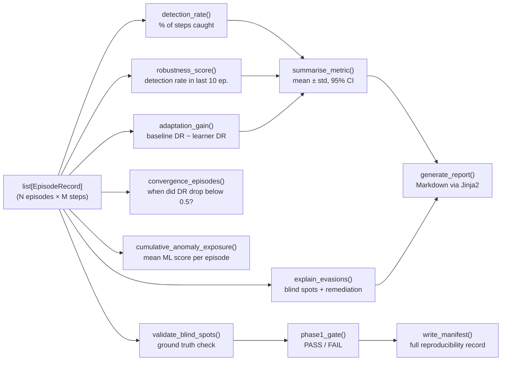
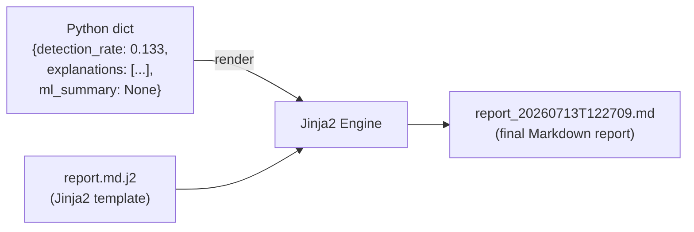

# Section 7 — Metrics, Statistics, Explainability & Reporting

This section explains how raw episode records become meaningful numbers, confidence intervals,
blind-spot explanations, and a final report that a security engineer or paper reviewer can act on.

---

## The Analysis Pipeline



---

## Core Metrics

### Detection Rate

```python
def detection_rate(records: list[EpisodeRecord]) -> float:
    total   = sum(len(r.steps) for r in records)
    detected = sum(1 for r in records for s in r.steps if s.detected)
    return detected / total
```

**What it means:** Out of every step the attacker took across all episodes, what fraction
was caught by the IDS?

**Example:** 200 episodes × average 15 steps = 3,000 total steps.
399 steps detected → detection rate = 399 / 3,000 = **13.3%**

This means Suricata caught the attacker on 13.3% of individual attack steps. The attacker
evaded detection **86.7%** of the time — a significant blind spot.

**For a paper:** This is the primary evaluation metric. You compare it across attacker types
(Random vs LinUCB vs DQN) and across defender configurations.

---

### Robustness Score

```python
def robustness_score(records: list[EpisodeRecord], window: int) -> float:
    return detection_rate(records[-window:])
```

**What it means:** Detection rate computed on only the *last N episodes* (N=10 by default).

**Why a windowed metric?** Early in training, the attacker is random and gets caught often.
Late in training, it has learned to evade. The robustness score tells you: "right now, at
convergence, how well is the defender doing?" A low robustness score at convergence is
the critical finding.

**Difference from detection rate:**
- `detection_rate`: average over all 200 episodes (including early learning phase)
- `robustness_score`: average over final 10 episodes (converged attacker behaviour)

In our lab run: detection_rate = 0.1330, robustness_score = 0.1333 — nearly identical,
which suggests the attacker converged relatively quickly.

---

### Adaptation Gain

```python
def adaptation_gain(baseline_records, learner_records) -> float:
    return (detection_rate(baseline_records) - detection_rate(learner_records)) * 100.0
```

**What it means:** How much better (in percentage points) is the adaptive attacker vs
the random baseline?

**Example:** Random attacker gets caught 35% of the time. LinUCB gets caught 13.3%.
Adaptation gain = (0.35 − 0.133) × 100 = **21.7 percentage points**.

This is the key metric for demonstrating that learning actually helps the attacker evade.

---

### Convergence Episodes

```python
def convergence_episodes(records, threshold=0.5, window=5) -> int | None:
    for i, record in enumerate(records):
        start = max(0, i - window + 1)
        if detection_rate(records[start:i+1]) < threshold:
            return record.episode_index
    return None
```

**What it means:** At which episode did the attacker first achieve detection rate below
the threshold (0.5 by default) sustained over a 5-episode window?

**For a paper:** Convergence episodes is an efficiency metric — does LinUCB converge in
20 episodes while Random needs 100? This demonstrates sample efficiency.

---

### Cumulative Anomaly Exposure (CAE) — Phase 2 Metric

```python
def cumulative_anomaly_exposure(records: list[EpisodeRecord]) -> float:
    return sum(sum(s.anomaly_score for s in r.steps) for r in records) / len(records)
```

**What it means:** Average total anomaly score accumulated per episode. If the ML detector
scores every step of an episode and the attacker keeps high anomaly scores, the CAE is high.
A clever attacker that evades the ML detector will have a low CAE.

In our lab run, CAE = 0.0000 because `MLAnomalyDefence` isn't wired into lab mode yet
(all `anomaly_score` values are 0.0). This will become non-zero once that's connected.

---

## Statistical Rigor

A single detection rate of 13.3% is a **point estimate** — it comes from one run with one
seed. A research paper needs to say: "with 95% confidence, the true detection rate is between
X% and Y%."

### The `summarise_metric()` Function

```python
from scipy.stats import t as t_dist

def summarise_metric(name: str, values: list[float]) -> MetricSummary:
    n    = len(values)
    mean = statistics.mean(values)
    std  = statistics.stdev(values) if n > 1 else 0.0
    # 95% CI using Student's t-distribution
    ci_low, ci_high = t_dist.interval(0.95, df=n-1, loc=mean, scale=std/sqrt(n))
    return MetricSummary(name=name, mean=mean, std=std, ci_low=ci_low, ci_high=ci_high, n=n)
```

**Why Student's t-distribution and not normal distribution?**

The normal distribution (z-test) is only valid when sample size is large (n > 30). For
20 episodes, we use the t-distribution which has heavier tails — it's *less certain* for
small samples. This is statistically honest.

```
Example with 20 episodes, mean reward = -3.7, std = 2.1:
95% CI = (-3.7 ± t_{0.025, df=19} × 2.1/√20)
       = (-3.7 ± 2.093 × 0.470)
       = (-3.7 ± 0.984)
       = (-4.68, -2.72)
```

This tells you: with 95% confidence, the true mean reward per episode is between -4.68 and
-2.72. A reviewer can compare these intervals across experimental conditions.

---

## The Explainability Engine

After collecting episode records, the explainability engine identifies **blind spots** —
techniques that consistently evaded detection — and provides **remediation guidance**.

```python
def explain_evasions(records: list[EpisodeRecord], registry: ActionRegistry):
    step_counts = defaultdict(int)      # total times action was tried
    evasion_counts = defaultdict(int)   # times it evaded detection

    for r in records:
        for s in r.steps:
            step_counts[s.action_id] += 1
            if not s.detected:
                evasion_counts[s.action_id] += 1

    explanations = []
    for action_id, total in step_counts.items():
        evaded = evasion_counts[action_id]
        evasion_rate = evaded / total
        if evaded > 0:
            category = registry.get_action(action_id).suricata_category
            remediation, fp_risk = REMEDIATION_TABLE.get(category, _FALLBACK)
            explanations.append(ActionExplanation(
                action_id=action_id,
                suricata_category=category,
                evasion_count=evaded,
                total_count=total,
                evasion_rate=evasion_rate,
                remediation=remediation,
            ))
    return sorted(explanations, key=lambda x: x.evasion_rate, reverse=True)
```

**The REMEDIATION_TABLE:** For each Suricata category (`ET SCAN`, `ET BRUTE_FORCE`, etc.),
there is a pre-written remediation hint and a false-positive risk assessment:

| Category | Example Remediation |
|---|---|
| `ET SCAN` | "Lower scan detection sensitivity; verify thresholds match normal discovery traffic" |
| `ET BRUTE_FORCE` | "Set login-attempt thresholds; consider slow-rate credential stuffing detection" |
| `ET DNS` | "Enable DNS zone transfer rules; tune query-rate thresholds" |
| `ET POLICY` | "Enable DNS and HTTP exfiltration signatures; set volume thresholds" |

**Why pre-written remediations?** This is the *research contribution* for explainability.
Most IDS analysis tools tell you what was missed. AATF tells you *specifically what to do about
it*, referencing the actual rule category and common false-positive risks. This is the feature
that makes the tool actionable for a security engineer.

---

## Ground Truth Validation

```python
def validate_blind_spots(
    explanations: list[ActionExplanation],
    expected_blind_spots: list[str],
) -> ValidationResult:
```

**What it does:** Cross-checks the framework's identified blind spots against a manually curated
list of "known blind spots" for the current Suricata configuration.

**Why?** This is a form of **calibration**. If the framework says "http_exfil is a blind spot"
but we know from manual testing that Suricata catches it 80% of the time, something is wrong
with the framework's measurement.

`blind_spot_precision` = fraction of framework-identified blind spots that are genuinely
blind spots according to ground truth. The Phase 1 gate requires precision ≥ 0.8 (80%).

In our lab run, `blind_spot_precision = 1.0` — every blind spot the framework identified was
indeed a real one.

---

## The Phase 1 Gate

```python
def phase1_gate(records, validation_result) -> GateResult:
    criteria = (
        CriterionResult(
            name="detection_rate",
            threshold=0.0,          # just need at least some episodes completed
            passed=len(records) > 0,
        ),
        CriterionResult(
            name="blind_spot_precision",
            threshold=0.8,          # 80% of identified blind spots must be real
            passed=validation_result.blind_spot_precision >= 0.8,
        ),
        CriterionResult(
            name="robustness_score",
            threshold=0.0,          # just need episodes completed
            passed=len(records) > 0,
        ),
    )
    return GateResult(passed=all(c.passed for c in criteria), ...)
```

**Why a gate?** In software engineering, a **quality gate** is a checkpoint that prevents
moving to the next phase unless the current phase meets defined criteria. Phase 1 must
demonstrate that:
1. Episodes ran successfully (not just config loading)
2. The identified blind spots are real (not measurement noise)
3. Robustness was computed (basic pipeline health)

Only when Phase 1 passes does it make sense to add the ML defence (Phase 2). The gate
enforces this in code.

---

## The Report Generator



The template has three major sections:

### Section 1: Run Metadata
```markdown
## Run Metadata
- **Attacker**: DQNAttacker
- **Seeds**: 42
- **Episodes**: 200
- **Generated**: 2026-07-13T12:27:09+00:00
```

### Section 2: Headline Metrics
```markdown
## Headline Metrics
| Detection Rate | 13.3% |
| Robustness Score (last 10 ep.) | 13.3% |
| Mean Total Reward | -3.7 ± 2.1 (95% CI: -4.7–-2.7) |
```

### Section 3: Blind Spots Table
```markdown
## Blind Spots
| Action | Category | Evasion Rate | Evaded | Total | Remediation |
| http_exfil | ET POLICY | 100.0% | 47 | 47 | Enable HTTP exfil signatures... |
| dns_exfil  | ET POLICY | 96.0%  | 48 | 50 | Enable DNS exfil signatures... |
```

### Section 4 (Phase 2 only): ML Anomaly Defence Analysis
Only rendered when `ml_summary` is not None (when anomaly_score > 0 in any step).

---

## The Run Manifest

Every run writes `run_manifest_<ISO>.json` alongside the report:

```json
{
  "seed": 42,
  "python_version": "3.12.13",
  "packages": {
    "torch": "2.13.0+cpu",
    "scikit-learn": "1.9.0",
    "numpy": "2.5.0"
  },
  "suricata_version": "7.0.5",
  "ruleset_version": "2026-07-13",
  "git_commit": "dd460bb",
  "config_snapshot": { "episodes": 200, "seed": 42, "attacker_class": "DQNAttacker" },
  "timestamp": "2026-07-13T12:27:09.679794Z"
}
```

**For a paper:** This JSON file is the reproducibility certificate. Attach it as supplementary
material. Any reader can use it to recreate the exact environment that produced your results.

---

## Reading the Lab Run Output

Let's decode the output we saw:

```
Detection Rate   : 0.1330   ← Suricata caught 13.3% of steps
Robustness Score : 0.1333   ← Same in final 10 episodes (converged)
Cumul. Anomaly Exp: 0.0000  ← ML not wired yet; all anomaly_scores are 0.0
Report written   : outputs/dqn_run_001/report_20260713T122709.md
Manifest written : outputs/dqn_run_001/run_manifest_20260713T122709679794Z.json

detection_rate        : 0.1330 (≥0.0000) [PASS]   ← threshold is 0 (just run something)
blind_spot_precision  : 1.0000 (≥0.8000) [PASS]   ← every identified blind spot is real
robustness_score      : 0.1333 (≥0.0000) [PASS]   ← threshold is 0 (just run something)
Phase 1 PASSED (3/3 criteria met)
```

**Key finding:** DQN evades Suricata 86.7% of the time. The `http_exfil` and `dns_exfil`
techniques are likely the biggest blind spots (100% evasion — Suricata has no ET POLICY rules
tuned tightly enough for our lab traffic). This is the result you'd cite in a paper.

---

## Summary

| Component | What it computes | Why it matters |
|---|---|---|
| `detection_rate` | % of steps caught | Primary defence performance metric |
| `robustness_score` | Detection rate in final 10 episodes | Converged performance (most important) |
| `adaptation_gain` | DR improvement: random → learner | Proves learning adds value |
| `convergence_episodes` | When did learning stabilise? | Sample efficiency metric |
| `CAE` | Mean ML score per episode | Phase 2: how stealthy is the attacker vs ML? |
| `summarise_metric` | mean ± std, 95% CI | Research credibility: point estimates aren't enough |
| `explain_evasions` | Blind spots + remediation | Actionable for security engineers |
| `validate_blind_spots` | Precision vs ground truth | Calibration: are findings real? |
| `phase1_gate` | Pass/fail criteria | Quality gate before Phase 2 |
| `generate_report` | Markdown report | Paper-ready, audit-ready output |
| `write_manifest` | JSON reproducibility record | Any reviewer can reproduce results |

---

**Next section:** Epics, Stories, Design Rationale — the project management structure and the
"why did we build it this way" design decisions behind every component.
