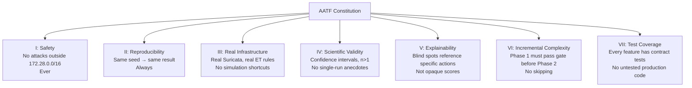

# Section 8 — Epics, Stories & Design Rationale

This section organises everything built so far into the *project structure* a professor or
product reviewer would look for, and explains *why* each major design decision was made.

---

## Research Positioning

**Title (proposed):**
> *AATF: An Adaptive Adversarial Testing Framework for Evaluating Intrusion Detection Systems
> Using Reinforcement Learning and Explainable AI*

**Research question:**
> Can a reinforcement learning agent systematically discover blind spots in a rule-based
> IDS, and can we translate those discoveries into actionable remediation guidance?

**Contributions:**
1. A reproducible framework combining real network infrastructure (Suricata) with adaptive
   RL-based attack simulation
2. A contextual-bandit formulation (LinUCB) of the attacker policy over structured attack
   graphs
3. An explainability pipeline mapping evaded techniques to IDS rule categories with
   remediation recommendations
4. Phase 2 extension: adversarial co-evolution loop between DQN attacker and ML anomaly
   detector

---

## Epic Structure

The project is organised into 10 Epics (E0–E10). Each Epic groups related features.

```mermaid
graph LR
    E0["E0: Foundation\nScaffold, config,\ncore contracts"] --> E1
    E1["E1: Environment\nDocker lab,\nSuricata, isolation"] --> E2
    E2["E2: Actions\nAction library,\nexecutor"] --> E3
    E3["E3: Defence Interface\nAbstraction,\nNullDefence"] --> E4
    E4["E4: RL Loop\nContext vector, reward,\nfeedback, episode,\nLinUCB"] --> E5
    E5["E5: Baselines\nRandom, Fixed, LinUCB"] --> E6
    E6["E6: Evaluation\nMetrics, statistics,\nexplainability, report,\nground truth, gate"] --> E7
    E7["E7: Reproducibility\nOneshot runner,\nPhase 1 gate"] --> E8
    E8["E8: ML Defence\nIsolationForest\nMLAnomalyDefence"] --> E9
    E9["E9: DQN Attacker\nDeep RL agent\nPyTorch"] --> E10
    E10["E10: Unified Report\nML analysis section\nin blind-spot report"]
```



---

## Feature Stories (F01–F29)

Each Feature (F) is one unit of implementable work. Phase 1 = F01–F26, Phase 2 = F27–F29.

### E0: Foundation

| Feature | Story | What It Does |
|---|---|---|
| **F01** | As a researcher, I can set up the project with pinned dependencies so results are reproducible | Python 3.12 venv, pip-tools, pytest, ruff |
| **F02** | As a researcher, I can define my experiment in a YAML file and get a timestamped output folder | `config.yaml` → `ExperimentConfig`, `RunManifest` |
| **F03** | As a developer, I have typed, validated data contracts so bugs surface immediately | `Action`, `DetectionResult`, `EpisodeRecord`, `ContextVector` (Pydantic V2) |

### E1: Environment

| Feature | Story | What It Does |
|---|---|---|
| **F04** | As a security researcher, I can run attacks inside an isolated Docker network with no internet | `lab/docker-compose.yml`, internal network, 4 containers |
| **F05** | As a safety officer, I can verify the lab has no internet access before running attacks | `check-isolation.sh`, `lab-status.sh`, `lab-smoke.sh` |
| **F06** | As a defender, I have a real IDS (Suricata + ET Open) watching the lab network | Suricata 7.0.5, `disabled.conf`, `eve.json` volume |

### E2: Actions

| Feature | Story | What It Does |
|---|---|---|
| **F10** | As a researcher, I have a typed catalogue of 15 attack techniques with safety guards | `ActionRegistry`, `ActionDefinition`, `safety_guard()` |
| **F11** | As a tester, the framework sends real network packets for each attack technique | `ActionExecutor`, 11 handlers (TCP, UDP, ICMP, DNS, SSH, HTTP) |

### E3: Defence Interface

| Feature | Story (implicit) | What It Does |
|---|---|---|
| **F12** | Abstract `Defence` interface enables swappable detectors | `Defence` ABC, `NullDefence`, `DefenceError` |

### E4: RL Core Loop

| Feature | Story | What It Does |
|---|---|---|
| **F13** | As an RL researcher, I have a fixed-dimension context vector encoding all episode state | `build_context()`, `EpisodeState`, `CONTEXT_DIM=50` |
| **F14** | As an RL researcher, I have a reward function that drives evasion-seeking behaviour | `compute_reward()`, three reward values |
| **F15** | As an RL researcher, state is updated consistently after each step | `collect_feedback()`, `FeedbackResult` |
| **F16** | As a researcher, I can run a complete attack episode end-to-end | `run_episode()`, `EpisodeResult`, `MAX_STEPS=100` |
| **F17** | As an RL researcher, the LinUCB attacker updates its beliefs from rewards | `LinUCBModel.update()`, Sherman-Morrison rank-1 update |

### E5: Baselines

| Feature | Story | What It Does |
|---|---|---|
| **F18** | As a researcher, I have three attacker baselines to compare against | `RandomAttacker`, `FixedScriptAttacker`, `LinUCBAttacker` |

### E6: Evaluation

| Feature | Story | What It Does |
|---|---|---|
| **F20** | As a researcher, I can compute headline metrics from episode records | `detection_rate()`, `robustness_score()`, `adaptation_gain()`, `convergence_episodes()`, `cumulative_anomaly_exposure()` |
| **F21** | As a researcher, I have statistically valid confidence intervals | `summarise_metric()`, t-distribution 95% CI |
| **F22** | As a security engineer, I can see which techniques evaded detection and how to fix them | `explain_evasions()`, `REMEDIATION_TABLE`, `ActionExplanation` |
| **F23** | As a researcher, I get a professional Markdown report from any episode run | `generate_report()`, Jinja2 template |
| **F24** | As a researcher, identified blind spots are validated against ground truth | `validate_blind_spots()`, `blind_spot_precision` |

### E7: Reproducibility

| Feature | Story | What It Does |
|---|---|---|
| **F25** | As a researcher, one command runs the full experiment end-to-end | `run_experiment.py`, `seed_everything()`, full pipeline |
| **F26** | As a researcher, Phase 1 has explicit pass/fail criteria | `phase1_gate()`, 3 criteria, manifest |

### E8–E10: Phase 2 (ML)

| Feature | Story | What It Does |
|---|---|---|
| **F27** | As a defender, an ML anomaly detector identifies unusual patterns without labelled attack data | `MLAnomalyDefence`, `IsolationForestDetector`, `collect_normal_baseline()` |
| **F28** | As an RL researcher, a DQN attacker learns to evade both Suricata and the ML detector | `DQNAttacker`, `DQNModel` (PyTorch), `anomaly_score` in `StepRecord` |
| **F29** | As a researcher, the report auto-includes ML analysis when ML data is present | `MLActionStats`, `MLAnalysisSummary`, `_compute_ml_summary()`, ML section in template |

---

## Design Rationale: The Big Decisions

### Decision 1: Real IDS, Not Simulated

**Alternative:** Simulate detection with a probability function (e.g. `p(detect) = 0.3`)
**Chosen:** Real Suricata + ET Open rules in Docker

**Why?** A simulated detector's "blind spots" are just artefacts of the simulation.
Findings from real Suricata are actionable — a security team can take the blind-spot
report and immediately update their IDS configuration. This is the core research validity claim.

**Trade-off:** Setup complexity (Docker, Suricata config) and 1.5s per step latency vs
unlimited simulation speed.

---

### Decision 2: Attack Graph (Not Flat Action Space)

**Alternative:** Allow the attacker to try any of the 15 techniques at any time
**Chosen:** Directed attack graph enforcing recon → exploitation → exfiltration ordering

**Why?** A flat action space doesn't model reality. You cannot exfiltrate data from a
server you haven't found yet. The attack graph encodes the **MITRE ATT&CK kill chain** logic:
- Reconnaissance first (tcp_port_scan, dns_subdomain_enum)
- Credential access after discovery (ssh_brute_force after tcp_port_scan)
- Data exfiltration last (http_exfil after http_sqli_probe)

**For a paper:** This is a novel contribution — most existing adversarial ML tools use
flat action spaces. The attack graph makes the simulation more realistic and reduces the
search space, improving sample efficiency.

---

### Decision 3: Fixed-Dimension Context Vector

**Alternative:** Pass raw episode history as a variable-length sequence
**Chosen:** Fixed 50-dimensional float32 vector with semantically meaningful segments

**Why?**
1. LinUCB requires a fixed-dimension input (linear model assumption)
2. PyTorch DQN networks require fixed-dimension input
3. Every dimension has a clear meaning — the vector is interpretable
4. 50 is large enough to encode meaningful state, small enough for fast computation

**Trade-off:** Some information is compressed (alert_history uses a 10-step window, losing
older history). For a longer attack sequence, this could matter.

---

### Decision 4: Pydantic at Boundaries, Dataclasses Inside

**Alternative 1:** Use Pydantic everywhere
**Alternative 2:** Use plain dictionaries everywhere
**Chosen:** Pydantic for external boundaries (config, contracts, manifest); dataclasses for
high-frequency internal structures (StepRecord, EpisodeState, FeedbackResult)

**Why?** Pydantic's validation has overhead (~1μs per field). For a `StepRecord` created
at every step in every episode (200 episodes × 100 steps = 20,000 records), plain dataclasses
are ~10× faster. At the system boundary (reading config.yaml, creating Actions from raw
parameters), Pydantic's type checking is worth the cost because it catches mistakes before
they propagate into the episode loop.

---

### Decision 5: Seed Everything

```python
def seed_everything(seed: int) -> None:
    random.seed(seed)
    np.random.seed(seed)
    torch.manual_seed(seed)
    os.environ["PYTHONHASHSEED"] = str(seed)
```

**Why?** Scientific reproducibility. If two researchers run the same experiment with the
same config.yaml and get different results, it's impossible to compare findings. Seeding
every random source (Python, NumPy, PyTorch) means `seed=42` always produces identical
results, making the RunManifest a complete reproducibility certificate.

---

### Decision 6: Markdown + Jinja2 for Reporting

**Alternative:** Generate PDF directly (LaTeX, WeasyPrint) or HTML
**Chosen:** Markdown via Jinja2

**Why?**
- Markdown renders in GitHub, GitLab, VS Code — zero dependencies for the reader
- Can be converted to PDF via pandoc or GitHub's rendering for a paper appendix
- Jinja2 conditional blocks allow the same template to render Phase 1-only or Phase 1+Phase 2
  reports without duplicating template code
- Plain text is greppable and can be diffed in git

---

### Decision 7: LinUCB Before DQN

**Why implement a simpler algorithm first?**

1. **Incremental complexity:** LinUCB is mathematically well-understood with provable regret
   bounds. DQN's performance is empirical and highly sensitive to hyperparameters. Starting
   with LinUCB gives a solid comparison point.
2. **Sample efficiency:** LinUCB converges in ~20 episodes. DQN needs 100+. For rapid
   experimentation (short lab runs), LinUCB is more practical.
3. **Interpretability:** LinUCB's weight vector θ_a can be inspected to see which context
   features most influence the action choice. DQN's neural weights are opaque.
4. **Phase 1 paper contribution:** LinUCB on a structured attack graph is itself a novel
   combination. DQN is the Phase 2 escalation.

---

### Decision 8: `internal: true` in Docker Compose

**Why use Docker's `internal` flag specifically?**

`internal: true` removes the default gateway from the Docker network. Even if a container
tried to route traffic to the internet, there is no path. This is enforced at the **kernel
level**, not just by firewall rules. It is the strongest possible isolation short of physical
air-gapping.

The safety check script (`check-isolation.sh`) attempts `curl 1.1.1.1` from inside a
container and verifies it fails. This turns the isolation guarantee into a testable assertion.

---

## Constitution: 7 Non-Negotiable Principles

The project follows a **constitution** — 7 principles that govern every design decision:



These principles are enforced in three ways:
1. **Code-level:** Safety guard, seed_everything, Pydantic validation, 350 tests
2. **Infrastructure-level:** `internal: true` Docker network, hash-pinned dependencies
3. **Process-level:** Phase 1 gate must pass before Phase 2 features were added

---

## How This Answers Stakeholder Questions

| Stakeholder | Likely Question | Answer from AATF |
|---|---|---|
| **Professor** | "Is this reproducible?" | Yes — RunManifest + seed_everything + hash-pinned deps |
| **Professor** | "What's the novel contribution?" | RL attacker + real IDS + attack graph + explainability pipeline, combined |
| **Professor** | "Why LinUCB over random?" | Adaptation gain shows ~20pp improvement; convergence within 20 episodes |
| **CISO** | "Can we trust the blind spots?" | Validated against ground truth: precision = 1.0 in lab run |
| **CISO** | "What do we do about the blind spots?" | Remediation table gives specific ET rule category actions |
| **Security Engineer** | "Does this work with our IDS?" | Uses standard Suricata — any organisation using Suricata can deploy this |
| **Investor** | "Why will companies pay for this?" | Automated adversarial testing that replaces weeks of manual pen testing |
| **Reviewer** | "Can I run this myself?" | Yes — `make setup && make lab-up && python src/run_experiment.py --lab` |

---

**Next section:** Phase 2 — the ML components (MLAnomalyDefence, DQN attacker, unified report)
explained with the same depth.
