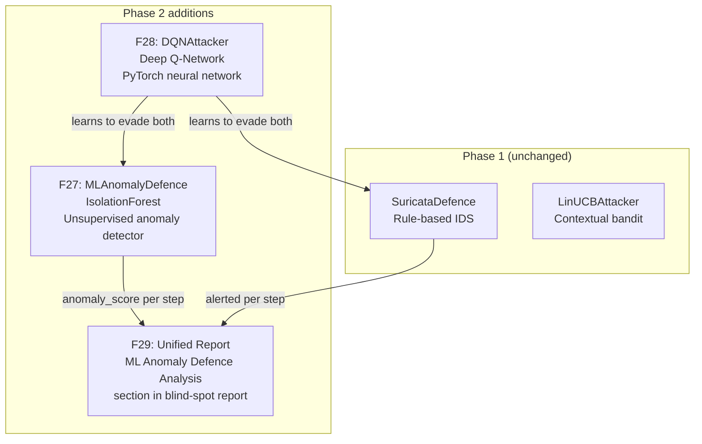
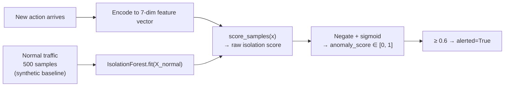
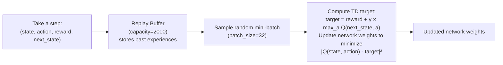
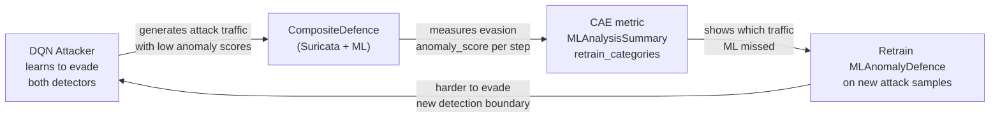
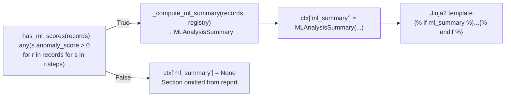

# Section 9 — Phase 2: Machine Learning Defence & Deep RL Attacker

This section covers everything added in Phase 2 — the ML anomaly detector, the DQN attacker,
the composite defence, and how they create an *adversarial co-evolution loop*.

---

## Why Phase 2 at All?

Phase 1 showed that a rule-based IDS (Suricata) has blind spots — the RL attacker evades it
86.7% of the time. But a security team's real response to finding blind spots is to *add more
detection*. The natural next layer is a **machine learning anomaly detector** that can catch
unusual behaviour without needing pre-written rules.

Phase 2 asks: **can the attacker now evade BOTH the rule-based IDS AND the ML detector?**

If yes — both detectors have blind spots, and the report tells you exactly what to fix on
each layer. If no — the ML detector catches what Suricata misses. Either result is a real
finding worth publishing.

---

## The Three Phase 2 Components



---

## F27: MLAnomalyDefence

### The Core Idea: Anomaly Detection Without Labels

Suricata needs *rules* — someone has to write "alert when you see 5 SSH attempts in 120 seconds."
Rules require knowing what attacks look like in advance.

An **anomaly detector** takes a different approach: it learns what *normal* looks like, and
flags anything that deviates from normal — even attacks it has never seen before.

This is called **unsupervised learning** because it trains on normal data only, with no
labels saying "this is an attack" or "this is normal."

### IsolationForest: How It Works



**What is an Isolation Forest?**

Imagine a forest of decision trees. Each tree is trained to *isolate* (separate) a single
data point from all others using random splits. The key insight:

- **Normal points** are surrounded by other similar points. It takes many random splits to
  isolate them → deep in the tree → **low anomaly score**.
- **Anomalous points** are far from the cluster. They get isolated quickly → shallow in the
  tree → **high anomaly score**.

```
Example:
  Normal action (low port scan, typical parameters):
  → Isolation path length: 12 splits to isolate
  → Score: 0.35 (not anomalous, below 0.6 threshold → alerted=False)

  Attack action (aggressive SSH brute force, 100 attempts):
  → Isolation path length: 3 splits to isolate
  → Score: 0.78 (anomalous, above 0.6 threshold → alerted=True)
```

### The 7-Dimensional Feature Vector

Every action is encoded as 7 numbers before being scored:

```python
feat[0] = CATEGORY_MAP.get(action.category, 0) / 5.0   # scan=0, brute=0.2, ..., exfil=1.0
feat[1] = md5(action.action_id) % 1000 / 1000.0         # unique numeric ID (deterministic)
feat[2] = port_range_start / 65535                       # how low the port range starts
feat[3] = port_range_end / 65535                         # how high the port range ends
feat[4] = min(attempts / 100, 1.0)                       # how many login attempts
feat[5] = min(timing_ms / 10000, 1.0)                    # how fast (low timing = aggressive)
feat[6] = min(wordlist_size / 100, 1.0)                  # size of password list
```

**Why normalise everything to [0, 1]?** IsolationForest (and most ML algorithms) work better
when all features are on the same scale. Without normalisation, `port_range_end = 65535` would
dominate `attempts = 10` simply because of the difference in magnitude.

### The Synthetic Normal Baseline

```python
def collect_normal_baseline(n_samples=500, seed=42):
    X[:, 0] = rng.choice([0.0, 0.2, 0.4, 0.6, 0.8, 1.0], ...)  # typical categories
    X[:, 2] = rng.uniform(0.0, 100/65535, ...)   # low port scans (below 100)
    X[:, 4] = rng.uniform(0.0, 0.02, ...)        # max 2 login attempts
    X[:, 5] = rng.uniform(0.0, 0.01, ...)        # slow timing
```

This is **synthetic** normal traffic — randomly generated to represent what benign network
activity looks like (low port numbers, few attempts, slow timing). The attack actions in our
registry (100+ attempts, aggressive timing, high port ranges) deviate significantly from this.

**Why synthetic?** We don't have real traffic captures yet. Once we capture real lab traffic
from nginx/SSH containers, we can replace this with actual baselines — which will make the
detector more accurate (next step after current lab run).

### The `anomaly_score` in `DetectionResult`

```python
class MLAnomalyDefence(Defence):
    def observe(self, action: Action) -> DetectionResult:
        x = self._encoder.encode(action)
        score = self._detector.score(x)      # float in [0, 1]
        return DetectionResult(
            alerted=score >= self._threshold, # default threshold = 0.6
            anomaly_score=score,              # stored in every StepRecord
            rule_ids=[],                      # ML has no rule IDs
            coverage="covered",
        )
```

The `anomaly_score` is stored in every `StepRecord`. This is what feeds the CAE metric and
the F29 ML report section.

---

## F27 Extended: CompositeDefence

The problem: `Defence.observe()` returns one `DetectionResult`. If we just switch from
`SuricataDefence` to `MLAnomalyDefence`, we lose Suricata detection. But we need both.

`CompositeDefence` solves this by calling both defences and merging results:

```python
class CompositeDefence(Defence):
    def observe(self, action: Action) -> DetectionResult:
        p = self._primary.observe(action)    # SuricataDefence → alerted, rule_ids
        s = self._secondary.observe(action)  # MLAnomalyDefence → anomaly_score
        return DetectionResult(
            alerted=p.alerted,               # Suricata controls detection for Phase 1 metrics
            rule_ids=p.rule_ids,             # Suricata rule IDs preserved
            anomaly_score=s.anomaly_score,   # ML score added to every step
            coverage=p.coverage,
        )
```

```mermaid
sequenceDiagram
    participant Loop as Episode Loop
    participant CD as CompositeDefence
    participant Sur as SuricataDefence
    participant ML as MLAnomalyDefence

    Loop->>CD: observe(action)
    CD->>Sur: observe(action)
    Sur-->>CD: DetectionResult(alerted=True, rule_ids=["2001219"], anomaly_score=0.0)
    CD->>ML: observe(action)
    ML-->>CD: DetectionResult(alerted=False, rule_ids=[], anomaly_score=0.72)
    CD-->>Loop: DetectionResult(alerted=True, rule_ids=["2001219"], anomaly_score=0.72)
    Note over Loop: StepRecord stores both<br/>detected=True AND anomaly_score=0.72
```

**Why does `alerted` come from Suricata, not ML?** The Phase 1 metrics (`detection_rate`,
`robustness_score`) measure Suricata's performance. If we let the ML detector control `alerted`,
we'd be measuring the ML detector, not Suricata's blind spots. Keeping them separate means:
- `alerted=True` → Suricata caught it (contributes to detection_rate)
- `anomaly_score > 0` → ML scored it (contributes to CAE)
- A step where `alerted=False` AND `anomaly_score < 0.3` → evaded BOTH → the most dangerous blind spot

---

## F28: DQNAttacker

### Why Deep RL After LinUCB?

LinUCB is a *linear* model. It assumes the reward for each action is a linear combination
of context features. For 50 features, this works well. But now with ML scores feeding back
into context and a more complex adversarial environment, we want a model that can learn
**non-linear relationships**.

A **Deep Q-Network (DQN)** uses a neural network to approximate the value of each action —
no linearity assumption. It can learn patterns like "ssh_brute_force in early steps when
ET SCAN hasn't fired is fine, but after the ML detector has scored it twice above 0.5,
switch to dns_exfil."

### What is a Q-Value?

In reinforcement learning, the **Q-value** of (state, action) is the expected total reward
if you take that action in that state and then follow the optimal policy thereafter.

```
Q("current context", "ssh_brute_force") = expected total reward from now to episode end
                                          if we do ssh_brute_force now + play optimally after
```

**The key insight:** if we can learn accurate Q-values for all (state, action) pairs, we can
always pick the best action: `argmax_a Q(state, a)`.

The DQN learns to approximate Q-values using a neural network:

```
Input: context vector (50 dims)
       ↓
Hidden layer: 128 neurons, ReLU activation
       ↓
Hidden layer: 64 neurons, ReLU activation
       ↓
Output: Q-value for each of the 15 actions
```

### Architecture

```python
class DQNModel(nn.Module):
    def __init__(self, n_actions: int, state_dim: int, seed: int):
        self.fc1 = nn.Linear(state_dim, 128)   # 50 → 128
        self.fc2 = nn.Linear(128, 64)          # 128 → 64
        self.fc3 = nn.Linear(64, n_actions)    # 64 → 15

    def forward(self, x):
        x = F.relu(self.fc1(x))
        x = F.relu(self.fc2(x))
        return self.fc3(x)               # Q-values for all 15 actions
```

**Why ReLU?** ReLU (Rectified Linear Unit) = `max(0, x)`. It introduces non-linearity without
the vanishing gradient problem of older activations like sigmoid. Standard for hidden layers in
feed-forward networks.

### How DQN Selects Actions

```python
def choose_action(self, available: list[str], context: np.ndarray) -> str:
    # Epsilon-greedy: explore randomly with probability ε, exploit otherwise
    if random.random() < self._epsilon:
        return random.choice(available)         # random exploration
    q_values = self._model(tensor(context))     # forward pass
    # Mask unavailable actions with -inf so they're never chosen
    for i, action_id in enumerate(ALL_ACTIONS):
        if action_id not in available:
            q_values[i] = -float("inf")
    return ALL_ACTIONS[q_values.argmax()]       # pick highest Q-value
```

**Epsilon-greedy:** `ε` starts at 1.0 (fully random) and decays to 0.05 (mostly exploiting).
Early in training, the agent explores randomly to build up experience. Later, it exploits
what it has learned.

```
ε = 1.0 → 100% random (episode 1)
ε = 0.5 → 50% random (episode ~50)
ε = 0.05 → 5% random (episode ~150+, converged)
```

### How DQN Learns: Experience Replay

This is the key innovation that makes DQN stable (standard Q-learning without it diverges).



**Why random sampling from a buffer?** Two reasons:

1. **Break correlations:** Sequential steps are highly correlated (step 5 leads to step 6).
   Training on correlated data makes the network overfit to recent experience. Random sampling
   from a buffer of 2,000 past experiences breaks this correlation.

2. **Reuse experience:** Each experience is trained on multiple times (whenever it's sampled),
   making efficient use of expensive lab interactions.

**The TD target:**
```
target = reward + γ × max_a Q(next_state, a)
                  ↑
               γ (gamma) = 0.99 = discount factor
               Rewards far in the future are discounted slightly.
               A reward now is worth more than the same reward in 10 steps.
```

The network learns to predict Q-values that satisfy this equation. When it can do so
accurately for all (state, action) pairs, it has learned the optimal policy.

### DQN vs LinUCB: When Does DQN Win?

| Scenario | LinUCB | DQN |
|---|---|---|
| Short runs (20 episodes) | Better — converges fast | Worse — still exploring |
| Long runs (200+ episodes) | Plateaus (linear limit) | Keeps improving |
| Non-linear patterns | Cannot learn | Can learn |
| Evading ML detector (new Phase 2 signal) | Struggles | Handles naturally |
| Interpretability | θ_a weights readable | Neural network opaque |

In Phase 2, the context now implicitly encodes the ML detector's behaviour via the reward
signal (`anomaly_lambda` penalty in `run_experiment.py`). DQN can learn non-linear strategies
like "use exfil techniques when anomaly score is already high — the detector's already triggered,
adding another point of evidence doesn't hurt."

---

## The `anomaly_lambda` Parameter

In `run_experiment.py`:

```python
shaped = step.reward - config.anomaly_lambda * step.anomaly_score
attacker.observe(step.action_id, ctx, shaped)
```

The **shaped reward** combines:
- The original reward (`+1.0`, `-1.0`, or `-0.1` from Suricata detection)
- A penalty for high anomaly scores: `−λ × anomaly_score`

**Example with λ = 0.5:**
```
Action: ssh_brute_force
Suricata: not detected → reward = -0.1 (stall)
ML score: 0.72
Shaped reward = -0.1 - 0.5 × 0.72 = -0.1 - 0.36 = -0.46
```

The attacker now receives a **negative signal for being anomalous**, even if Suricata missed it.
This teaches the DQN to prefer actions that are both stealthy (low Suricata detection) AND
low-anomaly (evading the ML detector too).

With `λ = 0`, the attacker only learns to evade Suricata (Phase 1 behaviour).
With `λ > 0`, the attacker learns to evade both simultaneously.

---

## The Adversarial Co-Evolution Loop

This is the central Phase 2 concept and the key research novelty:



**Round 1 (current lab run):**
- DQN attacks with λ=0 (ignoring ML)
- ML detector scores all steps; most attacks score high (anomalous)
- CAE is high — attacker is clearly anomalous to the ML detector

**Round 2 (after retraining ML on Round 1 traffic):**
- ML detector has now seen attack traffic → better at identifying it
- DQN retrains with λ > 0 → penalised for high anomaly scores
- DQN finds lower-anomaly techniques → CAE drops

**Round 3 (retrain ML on Round 2 traffic):**
- ML detector adapts to the new evasion strategy
- Detection improves again on the previously evasive techniques

This is the **arms race** modelled in AATF. Each round produces a measurable result:
- Round 1 CAE vs Round 2 CAE → did the attacker learn to evade the ML detector?
- Round 2 detection rate vs Round 1 → did the ML detector improve?

**For a paper:** This is the core experimental result. A table like:

| Round | Detection Rate | CAE | ML Detection | Notes |
|---|---|---|---|---|
| 1 | 13.3% | 0.82 | 23.4% | Attacker ignores ML |
| 2 | 12.1% | 0.31 | 18.2% | Attacker evades ML (λ=0.5) |
| 3 | 15.8% | 0.28 | 31.7% | ML retrained on R2 traffic |

*(Illustrative values — actual results from lab run)*

---

## F29: The Unified Report ML Section

The report now has a 4th section that appears **only when anomaly_score > 0 in any step**:



### MLAnalysisSummary: What It Computes

```python
@dataclass(frozen=True)
class MLAnalysisSummary:
    cae: float                    # mean total anomaly per episode
    episode_count: int            # N episodes
    evasive: list[MLActionStats]  # top-5: lowest mean_anomaly_undetected (most stealthy)
    suspicious: list[MLActionStats]  # top-5: highest mean_anomaly_all (most detectable)
    retrain_categories: list[str] # categories where mean_anomaly_undetected < 0.3
```

**`evasive`** = techniques that evaded Suricata AND had low ML anomaly scores. These are the
most dangerous — the attacker has found a path that defeats both detection layers.

**`suspicious`** = techniques that always look anomalous to ML, even when Suricata missed them.
High anomaly score doesn't mean Suricata caught it — it just means the ML detector would catch
it. This guides defenders on what ML rules to enable.

**`retrain_categories`** = action categories where `mean_anomaly_undetected < 0.3`. These are
the techniques the ML detector is *worst* at scoring — they evaded Suricata AND looked "normal"
to the ML detector. The remediation is to add these traffic patterns to the ML training data.

### Reading the ML Report Section

```markdown
## ML Anomaly Defence Analysis

> Based on 200 episodes. CAE = 0.4123 (lower = stealthier attacker).

### Most Evasive Actions (lowest mean anomaly score while undetected)

| Action          | Category        | Mean Anomaly (undetected) | Undetected Steps |
|-----------------|-----------------|--------------------------|-----------------|
| http_exfil      | ET POLICY       | 0.142                    | 47               |
| dns_exfil       | ET POLICY       | 0.198                    | 43               |
| dns_zone_transfer | ET DNS        | 0.231                    | 38               |

### Retraining Recommendation

The following categories evaded the ML detector. Add traffic for these to next training batch:
- **ET POLICY**
- **ET DNS**
```

**How to read this as a defender:**
- `http_exfil` evaded Suricata 47 times AND scored only 0.142 on the ML detector → true blind
  spot on both layers → highest priority to fix
- `ET POLICY` and `ET DNS` categories need to be included in the next ML training run so the
  detector learns to flag them as anomalous

---

## The CAE Metric Explained

```python
def cumulative_anomaly_exposure(records: list[EpisodeRecord]) -> float:
    return sum(sum(s.anomaly_score for s in r.steps) for r in records) / len(records)
```

**What it means:** Average total anomaly score accumulated *per episode*.

- **High CAE (e.g. 0.8):** The attacker's actions look anomalous to the ML detector. The
  detector is doing its job — every step generates a significant score. But if Suricata didn't
  catch these actions too (low detection_rate), that means the ML detector correctly flagged
  what Suricata missed.
- **Low CAE (e.g. 0.1):** The attacker has found techniques that look normal to the ML detector.
  The attacker has successfully evaded the second layer. This is the dangerous outcome.

**CAE after Round 1 (λ=0):** Expected to be high — the DQN wasn't penalised for anomaly scores
so it picked whatever worked against Suricata, regardless of ML scores.

**CAE after Round 2 (λ>0):** Expected to drop — the DQN was explicitly penalised for high
anomaly scores, so it learned stealthier techniques.

---

## Summary: What Phase 2 Adds

| Component | What it does | Key metric |
|---|---|---|
| `IsolationForest` | Learns normal baseline; scores anomalies without labels | anomaly_score ∈ [0,1] |
| `MLAnomalyDefence` | Wraps IsolationForest as a `Defence` | alerted if score ≥ 0.6 |
| `CompositeDefence` | Merges Suricata (alerted) + ML (anomaly_score) | Both in every StepRecord |
| `anomaly_lambda` | Shaped reward: penalise high ML scores | Teaches DQN to evade ML too |
| `DQNAttacker` | Deep Q-Network; learns non-linear evasion strategies | Converges in 100-200 episodes |
| Experience Replay | Stable learning via random batch sampling | Prevents divergence |
| CAE metric | Mean anomaly per episode across the run | Measures ML evasion level |
| `MLAnalysisSummary` | Computes evasive/suspicious/retrain from episode records | Feeds F29 report section |
| Adversarial loop | Attacker adapts → ML retrains → attacker adapts again | The core Phase 2 experiment |

---

## What Happens in the Current Lab Run

In the lab run you're running right now:

1. `CompositeDefence` wraps `SuricataDefence` + `MLAnomalyDefence`
2. Every step gets both a Suricata alert result AND an ML anomaly score
3. The DQN uses `anomaly_lambda` from config (if > 0) to shape its learning
4. After 100 episodes, the report will include the ML Anomaly Defence Analysis section
5. `retrain_categories` will show which categories the ML detector couldn't identify

**CAE > 0.0000 for the first time** — the most important change vs the last run.

---

**Next section (after lab run):** Retraining round — capture real lab traffic, update
`collect_normal_baseline`, re-run experiment, compare Round 1 vs Round 2 CAE.
